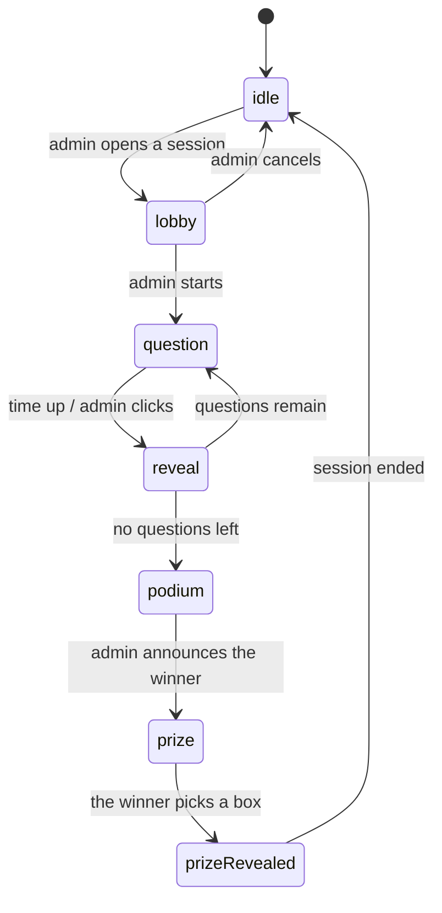

# Architecture

Stack: Vite 8 + React 19 + plain JavaScript + Tailwind CSS v4 + lucide-react +
qrcode.react. No TypeScript, no state library.

The backend is a ~200-line Node server in [server/](../server/) written with
`node:http` — **not a single added dependency** (no express, no socket.io). It
holds the game state for every device on the same LAN.

## Principles

**Feature-based, with MVC inside each feature.** Each area of the product is its
own box, and inside the box there are three layers. There is no global
`src/models/` — the logic of admin, player and display never gets mixed together.

Dependencies point one way only:

```
View  →  Controller  →  Model
```

- **Model** — plain JavaScript: data and game rules. No React import, no JSX, no
  DOM access. Immutable: every action returns a new instance; an invalid action
  returns the instance itself.
- **Controller** — a React hook. The **only** place allowed to have side effects:
  `useState`, `useEffect`, timers, repository reads and writes. No JSX, no game
  rules.
- **View** — JSX and Tailwind classes only. Only page-level views (`*Page.jsx`)
  may call a controller hook; components under `views/components/` are pure
  functions of their props.

**The single exception:** repositories live in `models/` but are allowed to touch
I/O (network, `localStorage`) — that is precisely why they exist. They are the
boundary; everything else in `models/` stays pure.

## Directory tree

```
server/                            # game server, node:http only
├── index.js                       #   serves dist/ + prints the LAN URLs
├── sessionApi.js                  #   SSE /api/events + POST /api/intent + /api/images
├── sessionStore.js                #   holds the SessionModel, applies intents, broadcasts
└── imageStore.js                  #   question images, hash-named, written to uploads/

src/
├── main.jsx
├── App.jsx                        # the routing table, 6 routes
├── index.css                      # @import tailwindcss + tokens in @theme
├── common/                        # shared by ≥2 features
│   ├── ids.js
│   ├── routing/useHashRoute.js    # ~60-line router on location.hash
│   ├── session/                   # ← the heart of the app
│   │   ├── models/
│   │   │   ├── SessionModel.js    #   the session state machine
│   │   │   ├── SessionRepository.js #  I/O: SSE in, POST intents out
│   │   │   ├── Quiz.js            #   the quiz (+ its editing methods)
│   │   │   ├── Question.js        #   a question, right/wrong marking, duration
│   │   │   ├── Leaderboard.js     #   scoring, ranking, ties
│   │   │   └── PrizeBoxes.js      #   shuffles the 3 prize boxes (Fisher–Yates)
│   │   └── controllers/
│   │       ├── useSession.js      #   listens to the server + sends intents
│   │       └── useNow.js          #   the clock tick for countdowns
│   └── views/                     # Button, Countdown, ProgressBar,
│                                  # LeaderboardTable, JoinQr, ConnectionBanner
└── features/
    ├── home/                      # H1 home page `/` — intro + entry to all 3 screens
    │   ├── controllers/useHomeController.js
    │   └── views/
    ├── admin/                     # A1 list, A2 quiz editor, A3 control desk
    │   ├── models/                #   QuizRepository + sample data
    │   ├── controllers/           #   useQuizListController, useQuizEditorController,
    │   │                          #   useLiveController
    │   └── views/
    ├── player/                    # P1–P6 on phones
    │   ├── controllers/usePlayerController.js
    │   └── views/
    └── display/                   # D1–D5 on the projector
        ├── controllers/useDisplayController.js
        └── views/
```

## Why the session lives in `common/`

The three screens **are not three applications**. All three read the same
`SessionModel` and only differ in how they draw it:

| State | Admin | Player | Display |
| --- | --- | --- | --- |
| `lobby` | the join list, Start button | "Waiting..." | large QR + join count |
| `question` | how many have answered | 4 tappable tiles | the question in huge type + clock |
| `reveal` | the pick distribution, Next button | right/wrong + points | the correct answer |
| `podium` | the leaderboard, Announce button | their own rank | the top 3 |
| `prize` | waiting | 3 boxes (winner only) | 3 boxes, prize opening |

If every surface kept its own copy of the state, the three screens would drift
apart. So the state machine is **one** shared model, and it belongs to no
feature.

## The session state machine



The table of valid transitions fits in one `ALLOWED_NEXT` constant in
[SessionModel.js](../src/common/session/models/SessionModel.js) — no state `if`s
scattered across controllers and views. An out-of-order action returns the very
same instance, so double-clicking "Next question" skips nothing, and the
repository knows nothing changed and broadcasts nothing.

**Only the server applies this state machine.** Clients send *intents* and the
server broadcasts the outcome. Auto-closing a question when time is up belongs to
the server too: there must be exactly one clock, and the game must not hang when
the admin locks their screen.

## Three technical decisions worth remembering

**The countdown stores an end timestamp, not "N seconds left".** The session
keeps `questionEndsAt` and every device computes the remainder itself. If each
device counted down independently from N seconds, after a few questions the
phones and the projector would drift seconds apart.

But that timestamp is on the **server clock**, so a device with the wrong time
subtracting against its own clock would see a badly wrong countdown (usually
stuck at 0 for the whole question). That is why every SSE frame carries
`serverNow`, the repository computes the offset, and `useNow` returns the
corrected time — see `serverNow()` in
[SessionRepository.js](../src/common/session/models/SessionRepository.js). Scoring
does not depend on any of this: `msTaken` is computed by the server, and a
phone's clock only affects the number shown on screen.

**`playerId` is kept in `localStorage`.** Phones get their screen locked or
refreshed mid-round constantly; coming back has to recognise the same person, not
create a new one, not lose their points, and not produce duplicate names on the
leaderboard. If the session no longer knows their name (server restart, admin
opening a new round), the controller resends `join` with the stored identity —
we are not making the whole room retype their names.

**Scores are recomputed from the answers, not stored on the player.** With only a
few dozen people and a handful of questions, recomputing is cheap, and it rules
out stored scores drifting out of sync with the answers.

## Realtime: a LAN server, SSE + intents

The game state lives in the RAM of one Node process running on the very machine
plugged into the projector. Phones join the same wifi and open
`http://<machine-ip>:3000`.

```
phone ──────┐
phone ──────┼─ POST /api/intent ──→ ┌──────────────┐
projector ──┤                       │ sessionStore │  SessionModel + Date.now()
admin ──────┘                       └──────┬───────┘
            └── GET /api/events ←───────────┘  SSE, full snapshot on every change
```

**The server is the source of truth, not a relay.** Clients send intents
(`{ type: 'answer', optionIndex: 2 }`), never state. Two reasons:

- If clients could write state directly, one phone could POST a fabricated
  session and award itself 10,000 points.
- `msTaken` (how fast someone answered) has to be measured by **one** clock. The
  question start is set by the server and so is the moment the answer lands; a
  phone clock off by seconds changes nothing. Letting the client compute it would
  reward whoever has the slowest clock.

**SSE rather than WebSocket / Socket.IO.** `EventSource` reconnects on its own
when the network hiccups — a phone that locks and unlocks its screen rejoins with
no retry loop to write. No client library needed, and no server-side dependency
either. The data flow here is exactly SSE-shaped: one broadcaster, many readers;
the reverse direction is only a handful of taps, so POST is plenty. Socket.IO
offers true bidirectional traffic and transport fallbacks — about 40 kB gzipped
for things this app does not use.

**Full snapshots, not diffs.** A phone joining mid-round is correct from its very
first frame, with no history to replay. With a few dozen people the payload stays
small anyway.

**Images travel their own path, not inside the snapshot.** Questions and options
can have images, but the quiz only keeps a **path** (`/api/images/<hash>.jpg`),
never a data URI. The reason is right above: every session change rebroadcasts the
whole snapshot, so putting base64 in there would make the entire room re-download
every image in the quiz each time one person taps an answer. The image bytes
travel exactly once, while the admin is writing the question:

```
admin ── POST /api/images (already shrunk) ──→ server/uploads/<hash>.jpg
                                    ↓ returns the path
                          the quiz in localStorage only stores the path
phones, projector ── GET /api/images/<hash>.jpg ──→ cached forever
```

The filename is the first 32 characters of the sha256 of the content: the same
image used in ten questions is still one file on disk, and since the name is
fixed by the content it is served with `Cache-Control: immutable` — a phone
downloads it once for the whole round. `ImageRepository` on the admin side shrinks
images to a 1200px long edge before sending; a 4MB phone photo sent as-is would
both blow past the limit and make visitors wait.

Unlike the session state, images are **written to disk** (`server/uploads/`,
gitignored) rather than kept in RAM: quizzes live in the admin machine's
localStorage and survive server restarts, and if the images did not survive too,
writing questions one evening would leave everything broken when the machine
boots the next morning.

**One copy of the game rules.** `server/sessionStore.js` imports the exact
`SessionModel.js` the client uses — there is no parallel "server-side rulebook" to
drift out of sync. This is the payoff of the model never importing React and never
calling `Date.now()` itself: it runs in node exactly as it runs in the browser.

**One handler for development and for live rounds.** `server/sessionApi.js` plugs
into Vite's middleware (see the `sessionApi` plugin in
[vite.config.js](../vite.config.js)), so `npm run dev:lan` keeps HMR while the
state is already real server state; with `npm run start`, `server/index.js` serves
`dist/` using that same handler.

`SessionRepository` is still the only boundary: `read()` is still synchronous and
still returns a `SessionModel` (it reads the most recent snapshot received), so
**`SessionModel` and every view needed zero changes** when the app moved from
localStorage to a server. What changed is `update(fn)` → `send(intent)`: clients
no longer apply the rules themselves.

**Remaining limitations:** the state is RAM-only, so stopping the server mid-round
loses the round in progress (start it again and open a new session — phones rejoin
by themselves). And anyone who knows the address can open `#/admin/live`; that is
acceptable in a hall, but if you want certainty, add a PIN to the admin intents.

## Interface rules

- **Black, white and shades of grey only.** No accent colour, no gradients, no
  dark mode.
- **Never use colour to carry information.** Right/wrong, selected, out of time
  are all distinguished by icon, border weight, dashed borders, grey fills,
  opacity and strikethrough. That is what keeps it readable for colour-blind
  viewers and on washed-out projectors.
- Icons come from `lucide-react`, **never emoji** (emoji carry their own colour,
  render differently per operating system, and blur on a projector). Icons that
  carry meaning get an `aria-label`; decorative ones get `aria-hidden`.
- Type size follows the surface: `display/` uses very large text readable from a
  distance, `player/` uses finger-sized tap targets, `admin/` uses ordinary sizes
  because it is viewed up close.

## Adding a feature

1. Identify the feature — modify an existing one if it belongs there, create
   `features/<name>/` if it is a new area.
2. New data and rules → `models/`.
3. State, side effects, timers → `controllers/`.
4. Interface → `views/`.

Code only moves into `src/common/` once a **second** feature genuinely needs it.
