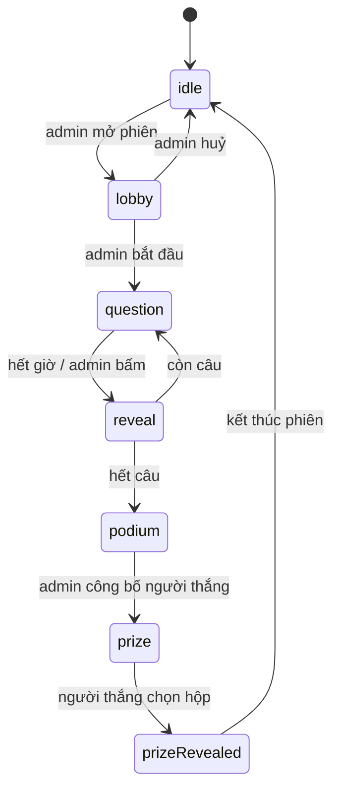

# Kiến trúc

Stack: Vite 8 + React 19 + JavaScript thuần + Tailwind CSS v4 + lucide-react +
qrcode.react. Không TypeScript, không thư viện state.

Backend là một máy chủ Node ~200 dòng trong [server/](../server/), viết bằng
`node:http` — **không thêm dependency nào** (không express, không socket.io). Nó
giữ trạng thái trận đấu cho mọi thiết bị trong cùng mạng LAN.

## Nguyên tắc

**Feature-based + MVC trong từng feature.** Mỗi mảng nghiệp vụ là một hộp riêng,
bên trong chia ba lớp. Không có `src/models/` toàn cục — logic của admin, player
và display không nằm lẫn vào nhau.

Phụ thuộc chỉ đi một chiều:

```
View  →  Controller  →  Model
```

- **Model** — JavaScript thuần: dữ liệu và luật chơi. Không import React, không
  JSX, không chạm DOM. Bất biến: mọi hành động trả về instance mới; hành động
  không hợp lệ trả về chính nó.
- **Controller** — React hook. Chỗ **duy nhất** được có side effect: `useState`,
  `useEffect`, timer, đọc/ghi repository. Không chứa JSX, không chứa luật chơi.
- **View** — chỉ JSX + class Tailwind. Chỉ view cấp trang (`*Page.jsx`) được gọi
  hook controller; component trong `views/components/` là hàm thuần nhận props.

**Ngoại lệ duy nhất:** repository nằm trong `models/` nhưng được chạm vào I/O
(mạng, `localStorage`) — đó chính là lý do nó tồn tại. Nó là ranh giới, mọi thứ
còn lại trong `models/` vẫn thuần.

## Cây thư mục

```
server/                            # máy chủ trận đấu, chỉ node:http
├── index.js                       #   phục vụ dist/ + in URL LAN
├── sessionApi.js                  #   SSE /api/events + POST /api/intent
└── sessionStore.js                #   giữ SessionModel, áp intent, phát cho mọi máy

src/
├── main.jsx
├── App.jsx                        # bảng phân tuyến 6 route
├── index.css                      # @import tailwindcss + token trong @theme
├── common/                        # dùng chung ≥2 feature
│   ├── ids.js
│   ├── routing/useHashRoute.js    # router ~60 dòng chạy trên location.hash
│   ├── session/                   # ← trái tim của app
│   │   ├── models/
│   │   │   ├── SessionModel.js    #   máy trạng thái phiên chơi
│   │   │   ├── SessionRepository.js #  I/O: SSE nhận về, POST gửi intent lên
│   │   │   ├── Quiz.js            #   bộ quiz (+ các phương thức sửa)
│   │   │   ├── Question.js        #   câu hỏi, chấm đúng/sai, thời lượng
│   │   │   ├── Leaderboard.js     #   chấm điểm, sắp hạng, đồng điểm
│   │   │   └── PrizeBoxes.js      #   xáo 3 hộp quà (Fisher–Yates)
│   │   └── controllers/
│   │       ├── useSession.js      #   nghe phiên từ máy chủ + gửi intent
│   │       └── useNow.js          #   nhịp đồng hồ cho đếm ngược
│   └── views/                     # Button, Countdown, ProgressBar,
│                                  # LeaderboardTable, JoinQr, ConnectionBanner
└── features/
    ├── home/                      # H1 trang chủ `/` — giới thiệu + lối vào 3 màn
    │   ├── controllers/useHomeController.js
    │   └── views/
    ├── admin/                     # A1 danh sách, A2 soạn quiz, A3 bàn điều khiển
    │   ├── models/                #   QuizRepository + dữ liệu mẫu
    │   ├── controllers/           #   useQuizListController, useQuizEditorController,
    │   │                          #   useLiveController
    │   └── views/
    ├── player/                    # P1–P6 trên điện thoại
    │   ├── controllers/usePlayerController.js
    │   └── views/
    └── display/                   # D1–D5 trên máy chiếu
        ├── controllers/useDisplayController.js
        └── views/
```

## Vì sao session nằm ở `common/`

Ba màn hình **không phải ba ứng dụng**. Cả ba đọc cùng một `SessionModel`, chỉ
khác cách vẽ ra:

| Trạng thái | Admin | Player | Display |
| --- | --- | --- | --- |
| `lobby` | danh sách người vào, nút Bắt đầu | "Đang chờ..." | QR to + số người |
| `question` | số người đã trả lời | 4 ô bấm được | câu hỏi chữ rất to + đồng hồ |
| `reveal` | phân bố lựa chọn, nút Câu tiếp | đúng/sai + điểm | đáp án đúng |
| `podium` | bảng hạng, nút Công bố | hạng của mình | top 3 |
| `prize` | chờ | 3 hộp (chỉ người thắng) | 3 hộp, mở quà |

Nếu mỗi surface tự giữ một bản trạng thái thì ba màn hình sẽ lệch nhau. Nên máy
trạng thái là **một** model dùng chung, và nó không thuộc feature nào.

## Máy trạng thái phiên chơi



Bảng chuyển trạng thái hợp lệ nằm gọn trong một hằng `ALLOWED_NEXT` ở
[SessionModel.js](../src/common/session/models/SessionModel.js) — không rải `if`
về trạng thái ra khắp controller và view. Hành động sai thứ tự trả về đúng
instance cũ, nên bấm "Câu tiếp" hai lần không nhảy mất câu, và repository biết là
không có gì đổi nên không phát tín hiệu.

**Chỉ máy chủ được áp máy trạng thái này.** Client gửi *ý định* lên, máy chủ áp
rồi phát kết quả về. Việc tự chốt câu khi hết giờ cũng thuộc máy chủ: chỉ được có
một đồng hồ, và trận đấu không được treo khi admin khoá màn hình.

## Ba quyết định kỹ thuật đáng nhớ

**Đếm ngược lưu mốc kết thúc, không lưu "còn N giây".** Session giữ
`questionEndsAt`, mỗi máy tự tính phần còn lại. Nếu mỗi máy đếm độc lập từ N giây
thì sau vài câu điện thoại và máy chiếu lệch nhau vài giây.

Nhưng mốc đó theo **đồng hồ máy chủ**, nên máy nào đặt sai giờ mà trừ theo đồng hồ
của nó sẽ thấy đếm ngược sai hẳn (thường là đứng ở 0 suốt câu). Vì vậy mỗi frame
SSE mang theo `serverNow`, repository tính độ lệch, và `useNow` trả về giờ đã bù —
xem `serverNow()` trong
[SessionRepository.js](../src/common/session/models/SessionRepository.js). Điểm số
không phụ thuộc vào chỗ này: `msTaken` do máy chủ tính, đồng hồ điện thoại chỉ ảnh
hưởng con số hiển thị.

**`playerId` lưu `localStorage`.** Điện thoại rất dễ bị tắt màn hình hoặc
refresh giữa trận; vào lại phải nhận đúng người cũ, không tạo người mới, không
làm mất điểm và không sinh tên trùng trên bảng hạng. Nếu phiên không còn thấy tên
mình (máy chủ khởi động lại, admin mở lượt mới) thì controller tự gửi lại `join`
bằng danh tính đã lưu — không lẽ bắt cả phòng gõ lại tên.

**Điểm tính lại từ đáp án, không lưu sẵn vào người chơi.** Chỉ vài chục người và
vài câu nên tính lại rất nhẹ, mà tránh được cảnh điểm đã lưu lệch với đáp án.

## Realtime: máy chủ LAN, SSE + intent

Trạng thái trận đấu sống trong RAM của một tiến trình Node chạy trên đúng cái máy
nối máy chiếu. Điện thoại vào cùng wifi rồi mở `http://<ip-máy>:3000`.

```
điện thoại ─┐
điện thoại ─┼─ POST /api/intent ──→ ┌──────────────┐
máy chiếu ──┤                       │ sessionStore │  SessionModel + Date.now()
admin ──────┘                       └──────┬───────┘
            └── GET /api/events ←───────────┘  SSE, ảnh chụp đầy đủ mỗi lần đổi
```

**Máy chủ là nguồn sự thật, không phải cái loa chuyển tiếp.** Client gửi ý định
(`{ type: 'answer', optionIndex: 2 }`), không gửi trạng thái. Hai lý do:

- Nếu client được ghi thẳng trạng thái thì một điện thoại có thể POST lên một
  phiên bịa đặt — tự cho mình 10 000 điểm.
- `msTaken` (trả lời nhanh cỡ nào) phải đo bằng **một** đồng hồ. Mốc bắt đầu câu
  do máy chủ đặt, mốc nhận đáp án cũng do máy chủ đặt; đồng hồ điện thoại lệch vài
  giây không ảnh hưởng gì. Nếu để client tự tính thì người có đồng hồ chạy chậm
  được thưởng.

**SSE chứ không WebSocket / Socket.IO.** `EventSource` tự kết nối lại khi mạng
chập — điện thoại khoá màn hình rồi mở lại là tự vào tiếp, không phải viết vòng
thử lại nào. Không cần thư viện phía client, cũng không thêm dependency phía
server. Luồng dữ liệu ở đây đúng hình dạng SSE: một máy phát, nhiều máy đọc; chiều
ngược lại chỉ vài cú bấm nên POST là đủ. Socket.IO cho hai chiều thật sự và nhiều
transport dự phòng — thêm ~40 kB gzip cho những thứ ở đây không dùng.

**Phát ảnh chụp đầy đủ, không phát diff.** Điện thoại vào giữa trận là đúng ngay ở
frame đầu, không cần phát lại lịch sử. Vài chục người thì payload vẫn nhỏ.

**Luật chơi chỉ có một bản.** `server/sessionStore.js` import đúng
`SessionModel.js` mà client dùng — không có "luật phía server" song song để lệch
nhau. Đây là phần thưởng của việc model không bao giờ import React và không tự gọi
`Date.now()`: nó chạy được trong node y như trong trình duyệt.

**Cùng một handler cho dev và lúc chạy trận.** `server/sessionApi.js` cắm vào
middleware của Vite (xem plugin `sessionApi` trong
[vite.config.js](../vite.config.js)) nên `npm run dev:lan` vẫn có HMR mà trạng
thái đã là trạng thái máy chủ thật; `npm run start` thì `server/index.js` phục vụ
`dist/` với đúng handler đó.

`SessionRepository` vẫn là ranh giới duy nhất: `read()` vẫn đồng bộ và vẫn trả về
`SessionModel` (nó đọc ảnh chụp gần nhất nhận được), nên **`SessionModel` và toàn
bộ view không phải sửa một dòng** khi app chuyển từ localStorage sang máy chủ.
Thay đổi là `update(fn)` → `send(intent)`: client không còn được tự áp luật.

**Giới hạn còn lại:** trạng thái chỉ ở RAM, tắt máy chủ giữa trận là mất trận đang
chạy (mở lại thì mở phiên mới — điện thoại tự vào lại). Và ai biết địa chỉ cũng mở
được `#/admin/live`; ở hội trường thì chấp nhận được, muốn chắc thì thêm mã PIN
cho intent của admin.

## Luật giao diện

- Chỉ **đen, trắng và các mức xám**. Không màu nhấn, không gradient, không dark mode.
- **Không dùng màu để truyền tải thông tin.** Đúng/sai, được chọn, hết giờ đều
  phân biệt bằng icon, độ đậm viền, viền nét đứt, fill xám, độ mờ, gạch ngang.
  Nhờ vậy người mù màu và máy chiếu bạc màu vẫn đọc được.
- Icon lấy từ `lucide-react`, **không dùng emoji** (emoji tự mang màu, render
  khác nhau theo hệ điều hành, và nhoè trên máy chiếu). Icon mang thông tin thì
  có `aria-label`, icon trang trí thì `aria-hidden`.
- Cỡ chữ theo surface: `display/` chữ rất lớn đọc từ xa, `player/` vùng bấm to
  cho ngón tay, `admin/` cỡ bình thường vì xem gần.

## Thêm tính năng mới

1. Xác định feature — thuộc feature đã có thì sửa trong đó, là mảng mới thì tạo
   `features/<tên>/`.
2. Dữ liệu và luật mới → `models/`.
3. State, side effect, timer → `controllers/`.
4. Giao diện → `views/`.

Code chỉ chuyển sang `src/common/` khi có feature **thứ hai** thật sự cần dùng.
