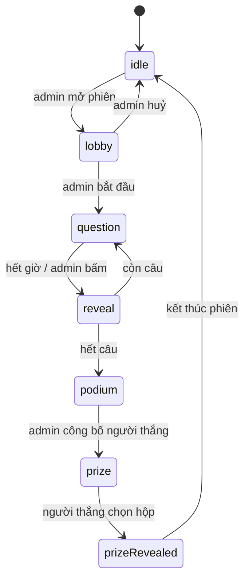

# Kiến trúc

Stack: Vite 8 + React 19 + JavaScript thuần + Tailwind CSS v4 + lucide-react +
qrcode.react. Không TypeScript, không thư viện state, không backend.

## Nguyên tắc

**Feature-based + MVC trong từng feature.** Mỗi mảng nghiệp vụ là một hộp riêng,
bên trong chia ba lớp. Không có `src/models/` toàn cục — logic của admin, player
và display không nằm lẫn vào nhau.

Phụ thuộc chỉ đi một chiều:

```
View  →  Controller  →  Model
```

- **Model** — JavaScript thuần: dữ liệu và luật chơi. Không import React, không
  JSX, không chạm DOM. Bất biến: mọi hành động trả về instance mới; hành động
  không hợp lệ trả về chính nó.
- **Controller** — React hook. Chỗ **duy nhất** được có side effect: `useState`,
  `useEffect`, timer, đọc/ghi repository. Không chứa JSX, không chứa luật chơi.
- **View** — chỉ JSX + class Tailwind. Chỉ view cấp trang (`*Page.jsx`) được gọi
  hook controller; component trong `views/components/` là hàm thuần nhận props.

**Ngoại lệ duy nhất:** repository nằm trong `models/` nhưng được chạm vào I/O
(`localStorage`, sau này là API/socket) — đó chính là lý do nó tồn tại. Nó là
ranh giới, mọi thứ còn lại trong `models/` vẫn thuần.

## Cây thư mục

```
src/
├── main.jsx
├── App.jsx                        # bảng phân tuyến 5 route
├── index.css                      # @import tailwindcss + token trong @theme
├── common/                        # dùng chung ≥2 feature
│   ├── ids.js
│   ├── routing/useHashRoute.js    # router ~60 dòng chạy trên location.hash
│   ├── session/                   # ← trái tim của app
│   │   ├── models/
│   │   │   ├── SessionModel.js    #   máy trạng thái phiên chơi
│   │   │   ├── SessionRepository.js #  I/O: localStorage + phát tín hiệu
│   │   │   ├── Quiz.js            #   bộ quiz (+ các phương thức sửa)
│   │   │   ├── Question.js        #   câu hỏi, chấm đúng/sai, thời lượng
│   │   │   ├── Leaderboard.js     #   chấm điểm, sắp hạng, đồng điểm
│   │   │   └── PrizeBoxes.js      #   xáo 3 hộp quà (Fisher–Yates)
│   │   └── controllers/
│   │       ├── useSession.js      #   đọc phiên + đăng ký nghe thay đổi
│   │       └── useNow.js          #   nhịp đồng hồ cho đếm ngược
│   └── views/                     # Button, Countdown, ProgressBar,
│                                  # LeaderboardTable, JoinQr
└── features/
    ├── admin/                     # A1 danh sách, A2 soạn quiz, A3 bàn điều khiển
    │   ├── models/                #   QuizRepository + dữ liệu mẫu
    │   ├── controllers/           #   useQuizListController, useQuizEditorController,
    │   │                          #   useLiveController
    │   └── views/
    ├── player/                    # P1–P6 trên điện thoại
    │   ├── controllers/usePlayerController.js
    │   └── views/
    └── display/                   # D1–D5 trên máy chiếu
        ├── controllers/useDisplayController.js
        └── views/
```

## Vì sao session nằm ở `common/`

Ba màn hình **không phải ba ứng dụng**. Cả ba đọc cùng một `SessionModel`, chỉ
khác cách vẽ ra:

| Trạng thái | Admin | Player | Display |
| --- | --- | --- | --- |
| `lobby` | danh sách người vào, nút Bắt đầu | "Đang chờ..." | QR to + số người |
| `question` | số người đã trả lời | 4 ô bấm được | câu hỏi chữ rất to + đồng hồ |
| `reveal` | phân bố lựa chọn, nút Câu tiếp | đúng/sai + điểm | đáp án đúng |
| `podium` | bảng hạng, nút Công bố | hạng của mình | top 3 |
| `prize` | chờ | 3 hộp (chỉ người thắng) | 3 hộp, mở quà |

Nếu mỗi surface tự giữ một bản trạng thái thì ba màn hình sẽ lệch nhau. Nên máy
trạng thái là **một** model dùng chung, và nó không thuộc feature nào.

## Máy trạng thái phiên chơi



Bảng chuyển trạng thái hợp lệ nằm gọn trong một hằng `ALLOWED_NEXT` ở
[SessionModel.js](../src/common/session/models/SessionModel.js) — không rải `if`
về trạng thái ra khắp controller và view. Hành động sai thứ tự trả về đúng
instance cũ, nên bấm "Câu tiếp" hai lần không nhảy mất câu, và repository biết là
không có gì đổi nên không phát tín hiệu.

**Chỉ bàn điều khiển của admin được đổi trạng thái**, kể cả việc tự chốt câu khi
hết giờ. Nếu để player và display cũng tự chốt thì mỗi máy chốt ở một thời điểm
khác nhau.

## Ba quyết định kỹ thuật đáng nhớ

**Đếm ngược lưu mốc kết thúc, không lưu "còn N giây".** Session giữ
`questionEndsAt`, mỗi máy tự tính phần còn lại theo đồng hồ của mình. Nếu mỗi máy
đếm độc lập từ N giây thì sau vài câu điện thoại và máy chiếu lệch nhau vài giây.

**`playerId` lưu `localStorage`.** Điện thoại rất dễ bị tắt màn hình hoặc
refresh giữa trận; vào lại phải nhận đúng người cũ, không tạo người mới, không
làm mất điểm và không sinh tên trùng trên bảng hạng.

**Điểm tính lại từ đáp án, không lưu sẵn vào người chơi.** Chỉ vài chục người và
vài câu nên tính lại rất nhẹ, mà tránh được cảnh điểm đã lưu lệch với đáp án.

## Điểm cắm realtime

`SessionRepository` là ranh giới duy nhất giữa app và nơi lưu trạng thái. Hiện nó
dùng `localStorage` + sự kiện `storage`, nên đồng bộ được giữa các tab trên cùng
một máy nhưng chưa qua được nhiều thiết bị.

Khi chốt được transport (Firebase / Supabase / Node + Socket.IO), chỉ file này
đổi: `read()` / `update()` / `subscribe()` giữ nguyên chữ ký, `SessionModel` và
toàn bộ view không phải sửa. Lúc đó các hàm sẽ thành `async` và controller thêm
cờ loading/lỗi.

## Luật giao diện

- Chỉ **đen, trắng và các mức xám**. Không màu nhấn, không gradient, không dark mode.
- **Không dùng màu để truyền tải thông tin.** Đúng/sai, được chọn, hết giờ đều
  phân biệt bằng icon, độ đậm viền, viền nét đứt, fill xám, độ mờ, gạch ngang.
  Nhờ vậy người mù màu và máy chiếu bạc màu vẫn đọc được.
- Icon lấy từ `lucide-react`, **không dùng emoji** (emoji tự mang màu, render
  khác nhau theo hệ điều hành, và nhoè trên máy chiếu). Icon mang thông tin thì
  có `aria-label`, icon trang trí thì `aria-hidden`.
- Cỡ chữ theo surface: `display/` chữ rất lớn đọc từ xa, `player/` vùng bấm to
  cho ngón tay, `admin/` cỡ bình thường vì xem gần.

## Thêm tính năng mới

1. Xác định feature — thuộc feature đã có thì sửa trong đó, là mảng mới thì tạo
   `features/<tên>/`.
2. Dữ liệu và luật mới → `models/`.
3. State, side effect, timer → `controllers/`.
4. Giao diện → `views/`.

Code chỉ chuyển sang `src/common/` khi có feature **thứ hai** thật sự cần dùng.
