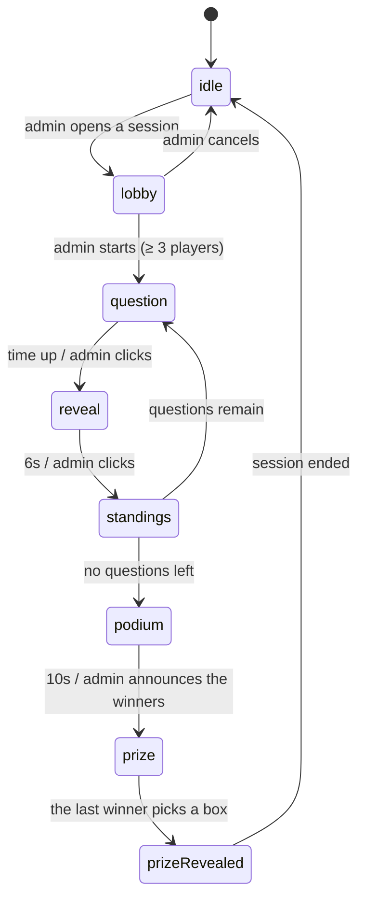

# Architecture

Stack: Vite 8 + React 19 + plain JavaScript + Tailwind CSS v4 + lucide-react +
qrcode.react + lottie-web (player avatars). No TypeScript, no state library.

The backend is a ~200-line Node server in [server/](../server/) written with
`node:http` — **not a single added dependency** (no express, no socket.io). It
holds the game state for every device on the same LAN.

## Principles

**Feature-based, with MVC inside each feature.** Each area of the product is its
own box, and inside the box there are three layers. There is no global
`src/models/` — the logic of admin, player and display never gets mixed together.

Dependencies point one way only:

```
View  →  Controller  →  Model
```

- **Model** — plain JavaScript: data and game rules. No React import, no JSX, no
  DOM access. Immutable: every action returns a new instance; an invalid action
  returns the instance itself.
- **Controller** — a React hook. The **only** place allowed to have side effects:
  `useState`, `useEffect`, timers, repository reads and writes. No JSX, no game
  rules.
- **View** — JSX and Tailwind classes only. Only page-level views (`*Page.jsx`)
  may call a controller hook; components under `views/components/` are pure
  functions of their props. Two shared views in `common/views/` run animation
  machinery a render cannot express — `PlayerAvatar` drives `lottie-web` and
  `ScoreCounter` a counting hook — and both are noted where they come up below.

**The single exception:** repositories live in `models/` but are allowed to touch
I/O (network, `localStorage`) — that is precisely why they exist. They are the
boundary; everything else in `models/` stays pure.

## Directory tree

```
server/                            # game server, node:http only
├── index.js                       #   serves dist/ + prints the LAN URLs
├── sessionApi.js                  #   SSE /api/events + POST /api/intent + /api/images
│                                  #   + REST /api/quizzes + /api/home
├── sessionStore.js                #   holds the SessionModel, applies intents, broadcasts
├── quizStore.js                   #   the quizzes, written to quizzes.json
├── homeStore.js                   #   the home page text, written to home.json
├── imageStore.js                  #   question images, hash-named, written to uploads/
└── adminAuth.js                   #   the admin password: scrypt hash in .env + tokens

src/
├── main.jsx
├── App.jsx                        # the routing table, 7 routes
├── index.css                      # @import tailwindcss + tokens in @theme
├── common/                        # shared by ≥2 features
│   ├── ids.js
│   ├── routing/useHashRoute.js    # ~60-line router on location.hash
│   ├── home/models/               # the home page text: home reads it, admin writes it
│   │   ├── HomeContent.js         #   the fields + their defaults
│   │   └── HomeContentRepository.js # I/O: GET/PUT /api/home
│   ├── session/                   # ← the heart of the app
│   │   ├── models/
│   │   │   ├── SessionModel.js    #   the session state machine
│   │   │   ├── SessionRepository.js #  I/O: SSE in, POST intents out
│   │   │   ├── Quiz.js            #   the quiz (+ its editing methods)
│   │   │   ├── Question.js        #   a question, right/wrong marking, duration,
│   │   │   │                      #   the option shuffle (Fisher–Yates)
│   │   │   ├── Leaderboard.js     #   scoring, ranking, ties, the top-ten movement
│   │   │   ├── PrizeBoxes.js      #   the prize catalogue + the shuffle (Fisher–Yates)
│   │   │   ├── Avatars.js         #   the 12 animals a player can pick
│   │   │   └── data/avatars/      #   their Lottie files (see docs/credits.md)
│   │   └── controllers/
│   │       ├── useSession.js      #   listens to the server + sends intents
│   │       ├── useNow.js          #   the clock tick for countdowns
│   │       └── useCountUp.js      #   the ticker a climbing score is drawn from
│   └── views/                     # Button, Countdown + CountdownBar, ProgressBar,
│                                  # LeaderboardTable, StandingsBoard,
│                                  # ScoreCounter, JoinQr, ConnectionBanner,
│                                  # PlayerAvatar, PrizeBoxRow + PrizeBox
│                                  # + PrizeCelebration, QuizImage
└── features/
    ├── home/                      # H1 home page `/` — the intro visitors read first
    │   ├── controllers/           #   useHomeController (session + text),
    │   │                          #   useHeadlineLayout (the rearranging title)
    │   └── views/
    ├── admin/                     # A1 list, A2 quiz editor, A3 control desk,
    │   │                          # A4 home page text
    │   ├── models/                #   QuizRepository (talks to /api/quizzes)
    │   │                          #   + AdminAuthRepository + the seed data
    │   ├── controllers/           #   useQuizListController, useQuizEditorController,
    │   │                          #   useLiveController, useAdminAuthController,
    │   │                          #   useHomeContentController
    │   └── views/                 #   *Page.jsx + AdminGate.jsx (the password lock)
    ├── player/                    # P1–P6 on phones
    │   ├── controllers/usePlayerController.js
    │   └── views/
    └── display/                   # D1–D5 on the projector
        ├── controllers/useDisplayController.js
        └── views/
```

## Why the session lives in `common/`

The three screens **are not three applications**. All three read the same
`SessionModel` and only differ in how they draw it:

| State | Admin | Player | Display |
| --- | --- | --- | --- |
| `lobby` | the join list, Start button | "Waiting..." | large QR + join count |
| `question` | how many have answered | 4 tappable tiles | the question in huge type + clock |
| `reveal` | the pick distribution, Show standings | right/wrong + points | the correct answer |
| `standings` | the top ten, Next button | the top ten + their own rank | the top ten, moving |
| `podium` | the full leaderboard, Announce button | their own rank + the top ten | the top ten |
| `prize` | who has opened what | 3 boxes (winners only, in turn) | every winner's boxes, prize opening |

If every surface kept its own copy of the state, the three screens would drift
apart. So the state machine is **one** shared model, and it belongs to no
feature.

## The session state machine



The table of valid transitions fits in one `ALLOWED_NEXT` constant in
[SessionModel.js](../src/common/session/models/SessionModel.js) — no state `if`s
scattered across controllers and views. An out-of-order action returns the very
same instance, so double-clicking "Next question" skips nothing, and the
repository knows nothing changed and broadcasts nothing.

Leaving the lobby has one extra condition: `start` needs a playable quiz **and**
at least `MIN_PLAYERS` (3) people in the lobby — `session.canStart`. Both Start
buttons (the control desk and the big screen) grey out until then, and the
control desk asks for a confirmation before sending the intent, because a round
that has begun can only be cancelled, never rewound. The count is checked in the
model rather than only in the views, since the admin page is not the only thing
that can send `start`.

**Only the server applies this state machine.** Clients send *intents* and the
server broadcasts the outcome. Auto-closing a question when time is up belongs to
the server too: there must be exactly one clock, and the game must not hang when
the admin locks their screen.

The same server tick drives **auto mode** (the *Auto* button on the control
desk, on by default): with `autoAdvance` on, each self-advancing step stamps an
`autoStepEndsAt` deadline and the tick calls `next()` once it passes, walking the
round from question to answer to standings to the next question, and on to the
final results. One field serves every waiting step because only one of them is
ever on screen; how long each lasts is `AUTO_SECONDS` in the model, next to the
question duration. It reuses the very transitions the admin's buttons send, so
auto mode can never reach a state a host could not reach by hand. It runs to the
end of the round: the podium hands over to the
prize step by announcing the top `winnerCount` of the leaderboard, which is why
"move on" from the podium *is* `announceWinners` rather than a separate path into
`prize`.

It stops for exactly two things, and both are decisions rather than steps: a
**tie across the winning line**, where no automatic rule can be fair and the desk
shows the tied names to pick from, and the **prize boxes**, which are the
winners' to tap.
`AUTO_SECONDS` is the whole list of self-advancing steps — a state missing from
that table is one auto mode never leaves by itself, and `#autoDeadlineFor` is
where the tie exception lives, so a step that cannot move on is never armed in
the first place instead of failing every tick.

## The options are reshuffled every round

A quiz is written top to bottom, so its correct answers end up clustered
wherever the author happened to type them. Play the same quiz twice at a stand
and the room stops reading the options and starts reading the pattern — "it is
always B" is a strategy, and it beats knowing the answer.

So the session never plays the quiz as it was saved. `openLobby` takes a copy
through `Quiz.withShuffledOptions`, which permutes each question's options with
Fisher–Yates (`Question.shuffledOptions`) and carries `correctIndex` **and** the
option images along with the same order — there is no arrangement that can put
one option's text next to another's picture, or leave the tick on the wrong slot.
Every question draws its own permutation, so the answer moves between questions
as well as between rounds. The `random` function is a parameter, exactly as in
`PrizeBoxes.shuffled`, so the model stays pure and a test can reproduce a
particular deal.

Three things follow from *where* it happens:

- **In the session, not in the editor.** A2 keeps showing the quiz in the order
  it was typed, which is the only order the person maintaining it can check.
  `quizzes.json` is never rewritten by playing a round.
- **Once, when the lobby opens** — not per question and not per player. A phone
  and the projector have to agree that the third answer is the one labelled C,
  and a stored `optionIndex` has to mean the same thing to everyone scoring it;
  reshuffling mid-round would also move an option out from under a finger that
  was already reaching for it.
- **On the server**, like every other rule. The arrangement travels inside the
  snapshot with the rest of the quiz, so all three surfaces receive it rather
  than each drawing their own.

## Three technical decisions worth remembering

**The countdown stores an end timestamp, not "N seconds left".** The session
keeps `questionEndsAt` and every device computes the remainder itself. If each
device counted down independently from N seconds, after a few questions the
phones and the projector would drift seconds apart.

But that timestamp is on the **server clock**, so a device with the wrong time
subtracting against its own clock would see a badly wrong countdown (usually
stuck at 0 for the whole question). That is why every SSE frame carries
`serverNow`, the repository computes the offset, and `useNow` returns the
corrected time — see `serverNow()` in
[SessionRepository.js](../src/common/session/models/SessionRepository.js). Scoring
does not depend on any of this: `msTaken` is computed by the server, and a
phone's clock only affects the number shown on screen.

**`playerId` is kept in `localStorage`, scoped to one session.** Two needs pull
against each other. A phone that locks its screen or gets refreshed mid-round has
to come back as the same person — otherwise its points vanish and the leaderboard
fills with duplicate names. But a phone handed to the next visitor between rounds
has to be a blank slate: at an Open Day one device is played by a stream of
different people, and inheriting the last visitor's name and animal is wrong.

The **session id** settles it. Every `openLobby` mints a new one (generated by
`sessionStore`, passed into the model like every other impure value), and the
stored identity carries the id of the session it was created in. Same id → the
controller resends `join` and the player gets their seat back. Different id → the
identity is ignored, the join form appears with an empty name and the default
avatar, and joining mints a fresh `playerId`.

The consequence worth knowing: a **server restart also ends the session**, so
everyone types their name again. That is the honest reading of RAM-only state —
the old round is gone, so the old identities should be too.

**Inside a session there is one way back, and it closes when the game starts.**
A visitor who mistypes their name or regrets their animal can hand the seat back:
`SessionModel.leave` drops the player and returns the name and the animal to the
pool. It works from the lobby and nowhere else — the moment the first question is
out, this player has answers and a score attached, and leaving would either throw
those away or strand the answers.

Two things trigger it and they share one code path so they cannot drift apart: a
**Change name or animal** button on the waiting screen, and a **reload of the
page**. Reload is in there because it is what people actually reach for, and in
the lobby there is nothing to lose by honouring it. After the first question the
same reload means the opposite — a dropped connection, not a change of mind — and
restores the seat instead.

Telling those two reloads apart needs no extra state on the wire: the controller
keeps a `joinedHere` ref, which is false on every fresh page load and set by
`join()`. An identity that exists while `joinedHere` is still false is one this
page load inherited rather than created. The check waits for the first SSE
snapshot rather than running at mount, because at mount the session is still
empty and a phone that reloaded mid-question would be thrown out of its own game.

**Leaving only *asks*; the snapshot decides.** `leave()` sends the intent and
nothing else — the stored identity is dropped when the session comes back
without us, not when we ask. Clearing it optimistically was tried and is a trap:
if the server does not carry out the leave, the phone lands on a join form it
cannot get out of, because the old player still holds the animal, so picking it
again is refused and nothing on screen explains why. Waiting for the snapshot
costs milliseconds and makes the failure honest — the waiting screen stays put.
The switch happens in the render that notices, not in the effect that follows
it, so the join form never mounts carrying the previous name.

**Scores are recomputed from the answers, not stored on the player.** With only a
few dozen people and a handful of questions, recomputing is cheap, and it rules
out stored scores drifting out of sync with the answers.

## Realtime: a LAN server, SSE + intents

The game state lives in the RAM of one Node process running on the very machine
plugged into the projector. Phones join the same wifi and open
`http://<machine-ip>:3000`.

```
phone ──────┐
phone ──────┼─ POST /api/intent ──→ ┌──────────────┐
projector ──┤                       │ sessionStore │  SessionModel + Date.now()
admin ──────┘                       └──────┬───────┘
            └── GET /api/events ←───────────┘  SSE, full snapshot on every change
```

**The server is the source of truth, not a relay.** Clients send intents
(`{ type: 'answer', optionIndex: 2 }`), never state. Two reasons:

- If clients could write state directly, one phone could POST a fabricated
  session and award itself 10,000 points.
- `msTaken` (how fast someone answered) has to be measured by **one** clock. The
  question start is set by the server and so is the moment the answer lands; a
  phone clock off by seconds changes nothing. Letting the client compute it would
  reward whoever has the slowest clock.

**SSE rather than WebSocket / Socket.IO.** `EventSource` reconnects on its own
when the network hiccups — a phone that locks and unlocks its screen rejoins with
no retry loop to write. No client library needed, and no server-side dependency
either. The data flow here is exactly SSE-shaped: one broadcaster, many readers;
the reverse direction is only a handful of taps, so POST is plenty. Socket.IO
offers true bidirectional traffic and transport fallbacks — about 40 kB gzipped
for things this app does not use.

**Full snapshots, not diffs.** A phone joining mid-round is correct from its very
first frame, with no history to replay. With a few dozen people the payload stays
small anyway.

**Images travel their own path, not inside the snapshot.** Questions and options
can have images, but the quiz only keeps a **path** (`/api/images/<hash>.jpg`),
never a data URI. The reason is right above: every session change rebroadcasts the
whole snapshot, so putting base64 in there would make the entire room re-download
every image in the quiz each time one person taps an answer. The image bytes
travel exactly once, while the admin is writing the question:

```
admin ── POST /api/images (already shrunk) ──→ server/uploads/<hash>.jpg
                                    ↓ returns the path
                          the stored quiz only keeps the path
phones, projector ── GET /api/images/<hash>.jpg ──→ cached forever
```

The filename is the first 32 characters of the sha256 of the content: the same
image used in ten questions is still one file on disk, and since the name is
fixed by the content it is served with `Cache-Control: immutable` — a phone
downloads it once for the whole round. `ImageRepository` on the admin side shrinks
images to a 1200px long edge before sending; a 4MB phone photo sent as-is would
both blow past the limit and make visitors wait.

Unlike the session state, images are **written to disk** (`server/uploads/`,
gitignored) rather than kept in RAM: quizzes survive server restarts, and if the
images did not survive too, writing questions one evening would leave everything
broken when the machine boots the next morning.

**Quizzes are content, so they are stored, and stored on the server.** They used
to sit in the admin browser's `localStorage`, which meant a quiz existed on the
one machine that typed it: open the admin page from another laptop and the list
was empty, clear the site data and the evening's work was gone. `quizStore.js`
now owns them and writes them to `server/quizzes.json` (gitignored), seeded from
`src/features/admin/models/data/` the first time the server starts.

They deliberately do *not* go through the intent/SSE path — that path exists for
match state the whole room must watch, while a quiz is content one person edits.
Plain REST is enough:

| | |
| --- | --- |
| `GET /api/quizzes` | the whole list |
| `PUT /api/quizzes/<id>` | insert or overwrite (the id in the URL wins over the body) |
| `DELETE /api/quizzes/<id>` | remove |

Two details worth knowing. Everything written goes through `Quiz.fromJSON(…)
.toJSON()` on the way in, so the file only ever holds the canonical shape and the
rules stay in one copy — the same reasoning as `sessionStore` importing
`SessionModel`. And a `PUT` overwrites the quiz every session is opened from, so
the editor does not send one behind the admin's back: edits live in the
controller's own state, the Save button asks for confirmation in `SaveDialog`,
and only that dialog calls `save()`. `saveState` ('unsaved' → 'saving' → 'saved'
| 'error') is what the badge and the dialog both read, and while it is 'unsaved'
the controller keeps a `beforeunload` guard on the window so a closed tab cannot
take the work quietly. Writes still cannot interleave server-side either:
`quizStore` chains them through one promise, which also covers two admins editing
from different machines.

`QuizRepository` is where all of this stops: every method became `async` and
`localStorage` became `fetch`, and nothing outside the admin controllers noticed
— `Quiz`, `Question` and every view were untouched. It also carries a one-time
migration that hands whatever an older version left in `localStorage` to the
server and then clears the key.

**The home page text travels the same road.** Everything a visitor reads on `/`
— the badge, the title, the paragraph, the buttons, the scrolling band, the three
steps, the prize blurb, the footer — is a flat record of strings in
[HomeContent.js](../src/common/home/models/HomeContent.js), edited on A4 and
served by `homeStore.js` from `server/home.json` (gitignored) over
`GET|PUT /api/home`. It is content one person edits, exactly like a quiz, so it
gets REST rather than the intent path, and the same "nothing is written until Save
is pressed" rule — with the home page it matters more, because half-typed
sentences would be published to everybody in the hall.

The model sits in `common/` because two features genuinely need it: `home/` reads
it, `admin/` writes it. Two rules live in it rather than in either feature. **A
blank field falls back to its default**, so no edit can leave the page with a hole
in it and "clear the box to get the original wording back" is one line on the
form; and **every read is normalised through `homeContentFromJSON`**, so a
`home.json` written before a field existed still produces a complete record. The
consequence of the first rule is that no piece of copy can be *removed* by
emptying it — a section that should disappear is a code change, which is what
happened to the old "Three screens, one game" block.

**The QR code on that page is not content.** Every address a code carries is
built from `window.location` by
[useHashRoute.js](../src/common/routing/useHashRoute.js) — `joinUrl()` for the
player route, `homeUrl()` for the page itself. They belong next to the routes
because they *are* routes, and a second copy of the same template string is
exactly how two screens end up printing different addresses. Building them from
the location is what makes them right without anybody configuring anything:
served over the LAN they print the LAN address, and served on `localhost` they
honestly print `localhost` (see docs/installation.md).

**The two codes do not lead to the same place, and that is the point.** The
control desk and the big screen carry `joinUrl()`: those are shown to a room that
has already been told what is happening, and the shortest path in is the join
form. The home page carries `homeUrl()` — the projector is not always showing
`/display`, and between rounds this page is what stands on it, where a visitor
scanning from across the hall has read none of it yet. Dropping them into a form
asking for a name is asking them to join something nobody has explained, so the
scan hands them the page instead and the Play button on it is their next step.

It is also why the code is sized in `vh` rather than pixels and is
tap-to-fullscreen: this one page has to work at arm's length on a phone and from
the back of a hall.

`useHomeController` swallows a failed load and keeps the defaults on purpose: a
visitor standing at the stand is better served by the original copy than by an
error where the headline should be, and `LiveStatus` already says when the server
is unreachable.

**One copy of the game rules.** `server/sessionStore.js` imports the exact
`SessionModel.js` the client uses — there is no parallel "server-side rulebook" to
drift out of sync. This is the payoff of the model never importing React and never
calling `Date.now()` itself: it runs in node exactly as it runs in the browser.

**One handler for development and for live rounds.** `server/sessionApi.js` plugs
into Vite's middleware (see the `sessionApi` plugin in
[vite.config.js](../vite.config.js)), so `npm run dev:lan` keeps HMR while the
state is already real server state; with `npm run start`, `server/index.js` serves
`dist/` using that same handler.

`SessionRepository` is still the only boundary: `read()` is still synchronous and
still returns a `SessionModel` (it reads the most recent snapshot received), so
**`SessionModel` and every view needed zero changes** when the app moved from
localStorage to a server. What changed is `update(fn)` → `send(intent)`: clients
no longer apply the rules themselves.

## The admin password

The three admin pages sit behind one password for the whole event — no accounts,
no roles, because the control desk is one machine run by one host.

**The password is never stored, only a scrypt hash of it**, in `.env` under
`ADMIN_PASSWORD_HASH` (gitignored, and invisible to the client bundle since Vite
only exposes `VITE_*`). scrypt rather than sha256: sha256 is fast, which is
exactly what makes it a bad password hash — a wordlist runs through it at millions
of guesses per second. scrypt is deliberately slow and memory-hungry, and it ships
with node, so it adds no dependency. The stored line is
`scrypt:<salt hex>:<key hex>`; the colon separator keeps the line safe to `source`
from a shell, where `$` — the usual separator — would expand.

**No password anywhere means "not set up yet", not "wide open".** On first run
`GET /api/admin/session` answers `configured: false` and the gate asks for a
password to *set* instead of one to type; `server/adminAuth.js` hashes it, writes
the line and refuses every later attempt to set another one, so the first-run
screen cannot become a way to take the desk over. A forgotten password is
recovered by deleting the line and restarting.

```
browser ── POST /api/admin/login ──→ adminAuth: scrypt compare, constant time
        ←──────── { token } ────────  RAM only, 12h
        ── x-admin-token on every admin write ──→ PUT /api/quizzes, POST /api/images
```

Tokens live in RAM exactly like the session state, so a restart signs every admin
browser out — the behaviour you want at the end of a day rather than a bug. The
browser keeps only the token, never the password. A wrong guess is answered after
a 400ms pause, which the host never notices and a wordlist very much does.

The three layers are the usual ones: `AdminAuthRepository` does the I/O (it is a
repository, so it may), `useAdminAuthController` turns it into the five states the
gate can be in — `checking / setup / locked / unlocked / unreachable` — and
`AdminGate` draws them. `unreachable` is deliberately not merged into `locked`:
telling a host their password is wrong when the real problem is a dead server
sends them hunting for the wrong thing in the middle of an event.

**What this does and does not cover.** The server refuses to write a quiz or
accept an image without the token, and the pages will not render without it. The
intents that drive a running round (`start`, `next`, `reveal`, …) are **not**
checked: they go through `POST /api/intent`, the one channel every phone in the
room uses, and gating them would mean pushing an admin token through
`SessionRepository` in `common/` — which the player and display surfaces share.
For a prototype in a hall that trade is deliberate; closing it means splitting the
intent endpoint in two, not sprinkling checks.

**Remaining limitations:** the state is RAM-only, so stopping the server mid-round
loses the round in progress (start it again and open a new session — phones rejoin
by themselves). And a live round can still be interfered with by anyone who knows
the address, per the paragraph above.

## Interface rules

- **Black, white and shades of grey only.** No accent colour, no gradients, no
  dark mode. **One exception:** the player avatars play in full colour — see
  below. Nothing else does.
- **Never use colour to carry information.** Right/wrong, selected, out of time
  are all distinguished by icon, border weight, dashed borders, grey fills,
  opacity and strikethrough. That is what keeps it readable for colour-blind
  viewers and on washed-out projectors.
- Icons come from `lucide-react`, **never emoji** (emoji carry their own colour,
  render differently per operating system, and blur on a projector). Icons that
  carry meaning get an `aria-label`; decorative ones get `aria-hidden`.
- Type size follows the surface: `display/` uses very large text readable from a
  distance, `player/` uses finger-sized tap targets, `admin/` uses ordinary sizes
  because it is viewed up close.

## Player avatars

When joining, a visitor picks one of fifty animals, which then stands for
them on the projector: in the lobby wall, in the leaderboard, next to the winner.
It is what turns a list of names into a room full of people.

The animations are Lottie files from lottiefiles.com, listed with their authors
in [credits.md](credits.md). Five decisions are worth writing down:

**They are committed, not fetched.** Hall wifi is the least reliable thing on the
day, and they are imported statically rather than served from `public/`, which is
what keeps every view that draws an avatar a pure function — no loading state, no
effect. The price is ~3MB in the bundle (≈480KB gzipped), which over a LAN is
nothing.

**One animal, one player, first come first served.** Two visitors sharing an
animal would undo the point of having them: the projector shows a wall of avatars
and a leaderboard of avatars, and two identical pandas make those unreadable. So
`SessionModel.join` refuses an avatar that is already spoken for, and the picker
draws the taken ones locked — greyed, dashed, padlocked, still labelled, so it is
clear the panda went to somebody rather than that the panda vanished.

The rule has to sit in the model and not only in the picker, because the picker
is reading a snapshot that is a moment old: when two people tap the same animal
at the same instant, only the intent that reaches the server first wins, and the
loser is sent back to the form with a note. The phone recovers on its own — its
suggested animal is always "the first one still free", recomputed on every
snapshot, so leaving the picker alone is enough.

The consequence is a **player cap equal to the size of the catalogue**. Fifty
people can be in a round; the fifty-first is told the round is full. That is
the honest trade for uniqueness, and the fix if it ever bites is more animals,
not a looser rule.

**They are in colour, and they always move.** This is the one deliberate
exception to the black-and-white rule, and it was taken on purpose: the avatar is
the only thing on screen a visitor owns, and greyscaled and frozen on its first
frame it reads as a grey sticker rather than as *their* animal. The exception is
narrow — it covers the animation and nothing around it. Every border, tick,
label and background near an avatar is still greyscale, and the rule that colour
must never be the only thing carrying information holds unchanged: selection in
the picker is a thick border plus a tick, first place is a trophy icon.

**Waiting is where the avatar gets the whole screen.** Between joining and the
first question a phone has nothing to do, and a screen reading "waiting" and
nothing else gets put in a pocket — and then the start is missed. So `P2` hands
the wait to the animal: 160px across, inside a static ring, a dashed ring turning
once every thirty seconds and a halo breathing once every six. The frame is
greyscale and deliberately slow; it says "still connected" without competing with
the animal for attention. The same arrangement returns at a third of the size
below the options once an answer is locked in — that is a wait too, and the only
one that happens *inside* a question.

While there is still a choice to make, though, the only avatar on screen is the
28px mark in the shell header. That is the whole point of the size ladder:
prominent exactly when there is nothing else to look at, out of the way the
moment there is.

The two screens that are *about* the player sit in between: the rank on the
podium and "You won!" before the boxes are opened both head their section with
the player's own animal at 64–80px, where a trophy icon used to be. It is their
result being announced, so the mark at the top of it is the one thing on screen
they own — but there is a leaderboard and a row of boxes to read underneath, so
it stops well short of the waiting screen's 160px. The trophy stays where it
carries information: marking first place in `LeaderboardTable`.

The cost is real and worth stating: every avatar on screen is a running Lottie
player. The lobby wall caps at 24, a display leaderboard shows 3, and the picker
shows 12 until the visitor presses **Show all 50 animals**. Both numbers were
measured rather than guessed — even the full fifty are on screen and animating
well under a second after the page opens on a phone-sized viewport, so the
preview is not there to rescue a frame rate.

It is there because fifty animals is thirteen rows, and someone happy with the
animal already selected should not have to scroll past nine of them to find the
join button. Collapsed, the whole form fits on one phone screen. The slice comes
off the front of the catalogue rather than off the animals still free, so tiles
never reshuffle under a finger already on its way down — joining as the wrong
animal cannot be undone. The one thing that forces the list open is the selection
sitting past the preview, which happens exactly when the first twelve have all
been claimed and a preview of twelve padlocks would help nobody.

**The model never sees the catalogue.** `SessionModel.join` stores the avatar as
a bare id string and knows nothing beyond "this string is already taken";
`Avatars.js` is imported only by views and by the player controller. That is not
tidiness: `server/sessionStore.js` imports `SessionModel`, so a catalogue import
would drag 3MB of JSON into the node server — which cannot even parse JSON
imports without import attributes. It is also why the model refuses a duplicate
rather than reassigning a free animal: it has no idea which animals exist.
Whoever draws an avatar resolves the id, and `avatarById()` falls back to the
first avatar when the id is unknown, so no screen ever has to handle a player
without a picture.

`PlayerAvatar` is the one view in the project that runs an effect. Driving
`lottie-web` means mounting a player into a DOM node and destroying it again,
which no amount of architecture turns into a pure render — and it is presentation
machinery, not a game rule, so it stays in the view rather than being pushed into
a controller. Nothing else touches the animation player.

## How many winners, and how they open their boxes

**The quiz says how many people win.** `Quiz.winnerCount` (1 to `MAX_WINNERS`,
edited on A2 and written to `quizzes.json`) travels into the session with the
rest of the quiz, so the host does not have to remember a number while a hall is
watching. `SessionModel.winnerCount` caps it at the number of players: three
prizes and two people in the room would otherwise leave the prize step waiting
for somebody who does not exist.

**Every winner gets their own three boxes.** `prizeBoxes` is an array of
`PrizeBoxes`, one per entry in `winnerIds` and shuffled separately, rather than
one shared set the winners take from in turn — everybody gets the same choice of
three, and nobody is handed whatever the person before them left behind.

**They open them one at a time, in rank order.** `pickingIndex` is just the first
winner with an unopened set, so the turn moves on by itself and there is no
"whose turn" field to keep in step with the boxes. The round stays in `prize`
until the last set is opened and only then moves to `prizeRevealed`, which is
what keeps the state machine unchanged for a round with one winner.

The big screen shows **all** the winners at once, each with their own row of
boxes, and dims the ones whose turn has not come. That is not decoration: if it
drew only the current picker, the box that just opened would be swapped for the
next winner's closed boxes the instant the pick landed, and the room would never
see what was in it. A phone only ever draws its own row, and only receives
`onPick` on its own turn — offering a tap the server is about to refuse is worse
than offering none.

## Opening a prize box

A box holds a **prize id**, not the prize itself: `PrizeBoxes.prizeIds` is a
permutation of the catalogue's ids, which is all the session state has to carry
over the wire, and `PRIZES` in
[PrizeBoxes.js](../src/common/session/models/PrizeBoxes.js) stays the one place
where the name and the description of a prize are written down. The views read
the rest through `prizeAt(index)` and `pickedPrize`. Which lucide icon stands for
which prize is presentation, so that map lives in the view, not in the model.

The unwrapping is three shared views — `PrizeBoxRow` (the row), `PrizeBox` (one
box) and `PrizeCelebration` (the fireworks) — and the winner's phone and the
projector draw all three in two sizes, so the two surfaces cannot drift apart in
what the room sees. The boxes wobble while they are closed. The moment one is
picked the other two collapse to nothing and the chosen one widens into the
space they leave, ending up in the middle of the screen at about twice its
resting size; then it shakes, throws the closed box off, pops the open one in
behind a burst of rays, stars and falling streamers, and finally raises the
prize and its description out of it.

The move to the middle is layout, not measurement: the row is centred, the two
abandoned boxes transition their width, padding and opacity to zero, and the
chosen one grows to fill the row — so it drifts to the centre on its own. The
spacing between boxes is padding on the items rather than a `gap`, because a
`gap` survives an item collapsing and would leave the last box hanging off
centre. Nothing here reads a bounding box, which is what keeps the whole reveal
inside the view layer.

The sequence is **CSS `animation-delay`, not a timer in a controller**. Every
step is a keyframe animation in [index.css](../src/index.css) with its own delay,
which keeps the animation out of the state machine entirely: it starts when the
snapshot carrying `pickedIndex` arrives, so the phone and the big screen open the
box together, and a device that reconnects halfway through simply plays it from
the top instead of catching up on a timer it never started. Individual stars and
streamers set a `--stagger` that the animation adds to that shared start time
(`calc(1.15s + var(--stagger, 0s))`), which is what stops the burst from firing
as one mechanical pulse. The reduced-motion block has to zero `animation-delay`
as well as the durations — shortening a duration does not shorten a delay, and
the whole reveal is delays.

## Ranking: shared ranks, and a board that stops at ten

Two rules in [Leaderboard.js](../src/common/session/models/Leaderboard.js) shape
every board in the app, and both are model rules rather than layout choices, so
the three surfaces cannot disagree about them.

**Equal scores share a rank.** `withRanks` compares scores only: 1, 2, 2, 4 —
competition ranking, with the used-up place skipped. Total answering time still
**orders** the list, it just no longer separates two equal scores into two
different numbers. A rank a visitor cannot explain from the points on their own
screen is a rank they will argue about at the stand.

Time is still what hands out the **prizes**, though, because there is a fixed
number of them: `winnerRows(count)` is simply the top `count` rows, so of the
players sharing a place the fastest one takes the slot with no admin action.
`hasTieAt(count)` is therefore *not* "several rows share a rank" — it is two
players equal on score **and** total time sitting either side of the line
between winning and not, the one case with no rule left to apply, and the only
one where the control desk asks a human to choose. It asks about the open slots
only: `settledRows(count)` are the winners no decision can change, and the host
fills the rest from `tiedRowsAt(count)`.

**Every board a visitor sees stops at `TOP_COUNT` (10) rows** — the standings
between questions and the final leaderboard, on the phone and on the projector
alike. Below tenth place a player is shown their own rank (`leaderboard.rowOf`)
and nothing about anybody else, which is why the player and display controllers
expose `topTen` and no longer expose the full `rows` at all: a view cannot leak
what its controller never handed it. The control desk keeps the whole list — the
host is the one person who needs it, not least to break a tie.

The cap is a rule about what is *drawn*. The SSE snapshot still carries every
player and every answer, because all three surfaces recompute the same
`Leaderboard` from it; a phone with the developer tools open can still work out
the ranking of the whole hall. Hiding it properly would mean the server sending
a different snapshot to every client, which is a different architecture than
the one in "Realtime" below, for a demo where the roster is a wall of animals
everyone can already see.

## The standings between two questions

Between the revealed answer and the next question the round stops on the **top
ten**, showing the move each player has just made: their new rank, how many
places they gained or lost, and the rank they came from.

It is a **state of the session** (`standings`), not a corner of the reveal
screen. The answer and the ranking are two different things to look at, and on a
projector they were fighting over the same space; a step of its own also means
the server owns the switch, so every phone and the big screen turn to the board
at the same moment — which is the whole reason the state machine lives on the
server. It costs one line in `ALLOWED_NEXT` and one branch in `next()`.

**Nothing about "before" is stored.** `SessionModel.previousLeaderboard` runs the
same scoring a second time over the answers with the current question's left out,
and `Leaderboard.movementFrom(previous)` joins the two rankings into rows
carrying `previousRank`, `previousScore`, `previousIndex` and `rankDelta`.
Keeping a snapshot of the last ranking on the session would be a second source of
truth for something the answers already say, and it would have to survive a
reconnect. Both are getters, so a device that joins mid-round computes the same
rows as everyone else from the snapshot it is handed.

Before the first question is scored the comparison is deliberately empty: at that
point everybody is level, and marking every row as "changed" says nothing. Those
rows draw no move at all, and their scores count up from zero.

`StandingsBoard` is a separate view from `LeaderboardTable` rather than a variant
of it, because it draws something the table has no use for: its rows are
**positioned by hand** at a fixed height so each one can travel from the place it
held to the place it holds now. The order of the three beats is what makes it
read as a change — the board appears in the **old** order, the scores tick up,
and only then do the rows slide past each other. A list that arrives already
sorted shows no movement, which is the one thing it is there for.

The travelling is CSS again (`animate-rank-slide`, with `--rank-from` /
`--rank-to` set per row and `both` parking the row at its old place for the
length of the delay), so it needs no measurement and no timer. The **score** is
the exception: a number cannot be counted up in CSS, so `useCountUp` ticks it
with `requestAnimationFrame` and `ScoreCounter` draws it. That hook sits in
`common/session/controllers/` with `useNow` because it owns a timer, and it also
has to check `prefers-reduced-motion` itself — the global CSS rule that flattens
every animation cannot reach a number counted in JavaScript.

## Adding a feature

1. Identify the feature — modify an existing one if it belongs there, create
   `features/<name>/` if it is a new area.
2. New data and rules → `models/`.
3. State, side effects, timers → `controllers/`.
4. Interface → `views/`.

Code only moves into `src/common/` once a **second** feature genuinely needs it.
