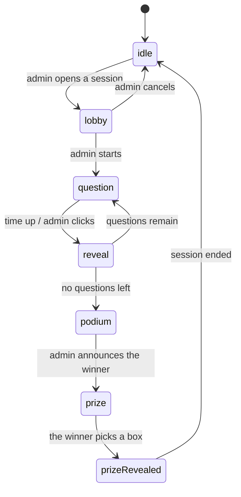

# Architecture

Stack: Vite 8 + React 19 + plain JavaScript + Tailwind CSS v4 + lucide-react +
qrcode.react + lottie-web (player avatars). No TypeScript, no state library.

The backend is a ~200-line Node server in [server/](../server/) written with
`node:http` — **not a single added dependency** (no express, no socket.io). It
holds the game state for every device on the same LAN.

## Principles

**Feature-based, with MVC inside each feature.** Each area of the product is its
own box, and inside the box there are three layers. There is no global
`src/models/` — the logic of admin, player and display never gets mixed together.

Dependencies point one way only:

```
View  →  Controller  →  Model
```

- **Model** — plain JavaScript: data and game rules. No React import, no JSX, no
  DOM access. Immutable: every action returns a new instance; an invalid action
  returns the instance itself.
- **Controller** — a React hook. The **only** place allowed to have side effects:
  `useState`, `useEffect`, timers, repository reads and writes. No JSX, no game
  rules.
- **View** — JSX and Tailwind classes only. Only page-level views (`*Page.jsx`)
  may call a controller hook; components under `views/components/` are pure
  functions of their props.

**The single exception:** repositories live in `models/` but are allowed to touch
I/O (network, `localStorage`) — that is precisely why they exist. They are the
boundary; everything else in `models/` stays pure.

## Directory tree

```
server/                            # game server, node:http only
├── index.js                       #   serves dist/ + prints the LAN URLs
├── sessionApi.js                  #   SSE /api/events + POST /api/intent + /api/images
│                                  #   + REST /api/quizzes
├── sessionStore.js                #   holds the SessionModel, applies intents, broadcasts
├── quizStore.js                   #   the quizzes, written to quizzes.json
└── imageStore.js                  #   question images, hash-named, written to uploads/

src/
├── main.jsx
├── App.jsx                        # the routing table, 6 routes
├── index.css                      # @import tailwindcss + tokens in @theme
├── common/                        # shared by ≥2 features
│   ├── ids.js
│   ├── routing/useHashRoute.js    # ~60-line router on location.hash
│   ├── session/                   # ← the heart of the app
│   │   ├── models/
│   │   │   ├── SessionModel.js    #   the session state machine
│   │   │   ├── SessionRepository.js #  I/O: SSE in, POST intents out
│   │   │   ├── Quiz.js            #   the quiz (+ its editing methods)
│   │   │   ├── Question.js        #   a question, right/wrong marking, duration
│   │   │   ├── Leaderboard.js     #   scoring, ranking, ties
│   │   │   ├── PrizeBoxes.js      #   shuffles the 3 prize boxes (Fisher–Yates)
│   │   │   ├── Avatars.js         #   the 12 animals a player can pick
│   │   │   └── data/avatars/      #   their Lottie files (see docs/credits.md)
│   │   └── controllers/
│   │       ├── useSession.js      #   listens to the server + sends intents
│   │       └── useNow.js          #   the clock tick for countdowns
│   └── views/                     # Button, Countdown, ProgressBar,
│                                  # LeaderboardTable, JoinQr, ConnectionBanner,
│                                  # PlayerAvatar
└── features/
    ├── home/                      # H1 home page `/` — intro + entry to all 3 screens
    │   ├── controllers/useHomeController.js
    │   └── views/
    ├── admin/                     # A1 list, A2 quiz editor, A3 control desk
    │   ├── models/                #   QuizRepository (talks to /api/quizzes)
    │   │                          #   + the seed data
    │   ├── controllers/           #   useQuizListController, useQuizEditorController,
    │   │                          #   useLiveController
    │   └── views/
    ├── player/                    # P1–P6 on phones
    │   ├── controllers/usePlayerController.js
    │   └── views/
    └── display/                   # D1–D5 on the projector
        ├── controllers/useDisplayController.js
        └── views/
```

## Why the session lives in `common/`

The three screens **are not three applications**. All three read the same
`SessionModel` and only differ in how they draw it:

| State | Admin | Player | Display |
| --- | --- | --- | --- |
| `lobby` | the join list, Start button | "Waiting..." | large QR + join count |
| `question` | how many have answered | 4 tappable tiles | the question in huge type + clock |
| `reveal` | the pick distribution, Next button | right/wrong + points | the correct answer |
| `podium` | the leaderboard, Announce button | their own rank | the top 3 |
| `prize` | waiting | 3 boxes (winner only) | 3 boxes, prize opening |

If every surface kept its own copy of the state, the three screens would drift
apart. So the state machine is **one** shared model, and it belongs to no
feature.

## The session state machine



The table of valid transitions fits in one `ALLOWED_NEXT` constant in
[SessionModel.js](../src/common/session/models/SessionModel.js) — no state `if`s
scattered across controllers and views. An out-of-order action returns the very
same instance, so double-clicking "Next question" skips nothing, and the
repository knows nothing changed and broadcasts nothing.

**Only the server applies this state machine.** Clients send *intents* and the
server broadcasts the outcome. Auto-closing a question when time is up belongs to
the server too: there must be exactly one clock, and the game must not hang when
the admin locks their screen.

The same server tick drives **auto mode** (the *Auto* button on the control
desk, on by default): with `autoAdvance` on, `reveal` stamps a `revealEndsAt` deadline and the
tick calls `next()` once it passes, walking the round from question to reveal to
the next question and finally to the podium. It reuses the very transitions the
admin's buttons send, so auto mode can never reach a state a host could not
reach by hand — and it deliberately stops at the podium, because a tie for first
place needs a human to choose the winner.

## Three technical decisions worth remembering

**The countdown stores an end timestamp, not "N seconds left".** The session
keeps `questionEndsAt` and every device computes the remainder itself. If each
device counted down independently from N seconds, after a few questions the
phones and the projector would drift seconds apart.

But that timestamp is on the **server clock**, so a device with the wrong time
subtracting against its own clock would see a badly wrong countdown (usually
stuck at 0 for the whole question). That is why every SSE frame carries
`serverNow`, the repository computes the offset, and `useNow` returns the
corrected time — see `serverNow()` in
[SessionRepository.js](../src/common/session/models/SessionRepository.js). Scoring
does not depend on any of this: `msTaken` is computed by the server, and a
phone's clock only affects the number shown on screen.

**`playerId` is kept in `localStorage`, scoped to one session.** Two needs pull
against each other. A phone that locks its screen or gets refreshed mid-round has
to come back as the same person — otherwise its points vanish and the leaderboard
fills with duplicate names. But a phone handed to the next visitor between rounds
has to be a blank slate: at an Open Day one device is played by a stream of
different people, and inheriting the last visitor's name and animal is wrong.

The **session id** settles it. Every `openLobby` mints a new one (generated by
`sessionStore`, passed into the model like every other impure value), and the
stored identity carries the id of the session it was created in. Same id → the
controller resends `join` and the player gets their seat back. Different id → the
identity is ignored, the join form appears with an empty name and the default
avatar, and joining mints a fresh `playerId`.

The consequence worth knowing: a **server restart also ends the session**, so
everyone types their name again. That is the honest reading of RAM-only state —
the old round is gone, so the old identities should be too.

**Inside a session there is one way back, and it closes when the game starts.**
A visitor who mistypes their name or regrets their animal can hand the seat back:
`SessionModel.leave` drops the player and returns the name and the animal to the
pool. It works from the lobby and nowhere else — the moment the first question is
out, this player has answers and a score attached, and leaving would either throw
those away or strand the answers.

Two things trigger it and they share one code path so they cannot drift apart: a
**Change name or animal** button on the waiting screen, and a **reload of the
page**. Reload is in there because it is what people actually reach for, and in
the lobby there is nothing to lose by honouring it. After the first question the
same reload means the opposite — a dropped connection, not a change of mind — and
restores the seat instead.

Telling those two reloads apart needs no extra state on the wire: the controller
keeps a `joinedHere` ref, which is false on every fresh page load and set by
`join()`. An identity that exists while `joinedHere` is still false is one this
page load inherited rather than created. The check waits for the first SSE
snapshot rather than running at mount, because at mount the session is still
empty and a phone that reloaded mid-question would be thrown out of its own game.

**Leaving only *asks*; the snapshot decides.** `leave()` sends the intent and
nothing else — the stored identity is dropped when the session comes back
without us, not when we ask. Clearing it optimistically was tried and is a trap:
if the server does not carry out the leave, the phone lands on a join form it
cannot get out of, because the old player still holds the animal, so picking it
again is refused and nothing on screen explains why. Waiting for the snapshot
costs milliseconds and makes the failure honest — the waiting screen stays put.
The switch happens in the render that notices, not in the effect that follows
it, so the join form never mounts carrying the previous name.

**Scores are recomputed from the answers, not stored on the player.** With only a
few dozen people and a handful of questions, recomputing is cheap, and it rules
out stored scores drifting out of sync with the answers.

## Realtime: a LAN server, SSE + intents

The game state lives in the RAM of one Node process running on the very machine
plugged into the projector. Phones join the same wifi and open
`http://<machine-ip>:3000`.

```
phone ──────┐
phone ──────┼─ POST /api/intent ──→ ┌──────────────┐
projector ──┤                       │ sessionStore │  SessionModel + Date.now()
admin ──────┘                       └──────┬───────┘
            └── GET /api/events ←───────────┘  SSE, full snapshot on every change
```

**The server is the source of truth, not a relay.** Clients send intents
(`{ type: 'answer', optionIndex: 2 }`), never state. Two reasons:

- If clients could write state directly, one phone could POST a fabricated
  session and award itself 10,000 points.
- `msTaken` (how fast someone answered) has to be measured by **one** clock. The
  question start is set by the server and so is the moment the answer lands; a
  phone clock off by seconds changes nothing. Letting the client compute it would
  reward whoever has the slowest clock.

**SSE rather than WebSocket / Socket.IO.** `EventSource` reconnects on its own
when the network hiccups — a phone that locks and unlocks its screen rejoins with
no retry loop to write. No client library needed, and no server-side dependency
either. The data flow here is exactly SSE-shaped: one broadcaster, many readers;
the reverse direction is only a handful of taps, so POST is plenty. Socket.IO
offers true bidirectional traffic and transport fallbacks — about 40 kB gzipped
for things this app does not use.

**Full snapshots, not diffs.** A phone joining mid-round is correct from its very
first frame, with no history to replay. With a few dozen people the payload stays
small anyway.

**Images travel their own path, not inside the snapshot.** Questions and options
can have images, but the quiz only keeps a **path** (`/api/images/<hash>.jpg`),
never a data URI. The reason is right above: every session change rebroadcasts the
whole snapshot, so putting base64 in there would make the entire room re-download
every image in the quiz each time one person taps an answer. The image bytes
travel exactly once, while the admin is writing the question:

```
admin ── POST /api/images (already shrunk) ──→ server/uploads/<hash>.jpg
                                    ↓ returns the path
                          the stored quiz only keeps the path
phones, projector ── GET /api/images/<hash>.jpg ──→ cached forever
```

The filename is the first 32 characters of the sha256 of the content: the same
image used in ten questions is still one file on disk, and since the name is
fixed by the content it is served with `Cache-Control: immutable` — a phone
downloads it once for the whole round. `ImageRepository` on the admin side shrinks
images to a 1200px long edge before sending; a 4MB phone photo sent as-is would
both blow past the limit and make visitors wait.

Unlike the session state, images are **written to disk** (`server/uploads/`,
gitignored) rather than kept in RAM: quizzes survive server restarts, and if the
images did not survive too, writing questions one evening would leave everything
broken when the machine boots the next morning.

**Quizzes are content, so they are stored, and stored on the server.** They used
to sit in the admin browser's `localStorage`, which meant a quiz existed on the
one machine that typed it: open the admin page from another laptop and the list
was empty, clear the site data and the evening's work was gone. `quizStore.js`
now owns them and writes them to `server/quizzes.json` (gitignored), seeded from
`src/features/admin/models/data/` the first time the server starts.

They deliberately do *not* go through the intent/SSE path — that path exists for
match state the whole room must watch, while a quiz is content one person edits.
Plain REST is enough:

| | |
| --- | --- |
| `GET /api/quizzes` | the whole list |
| `PUT /api/quizzes/<id>` | insert or overwrite (the id in the URL wins over the body) |
| `DELETE /api/quizzes/<id>` | remove |

Two details worth knowing. Everything written goes through `Quiz.fromJSON(…)
.toJSON()` on the way in, so the file only ever holds the canonical shape and the
rules stay in one copy — the same reasoning as `sessionStore` importing
`SessionModel`. And because the editor saves on every keystroke, several requests
are in flight at once: `quizStore` chains its writes through one promise so two
`writeFile` calls cannot interleave, while the editor controller lets only the
newest request update the "Saved" badge so a slow early reply cannot claim a
later change has landed.

`QuizRepository` is where all of this stops: every method became `async` and
`localStorage` became `fetch`, and nothing outside the admin controllers noticed
— `Quiz`, `Question` and every view were untouched. It also carries a one-time
migration that hands whatever an older version left in `localStorage` to the
server and then clears the key.

**One copy of the game rules.** `server/sessionStore.js` imports the exact
`SessionModel.js` the client uses — there is no parallel "server-side rulebook" to
drift out of sync. This is the payoff of the model never importing React and never
calling `Date.now()` itself: it runs in node exactly as it runs in the browser.

**One handler for development and for live rounds.** `server/sessionApi.js` plugs
into Vite's middleware (see the `sessionApi` plugin in
[vite.config.js](../vite.config.js)), so `npm run dev:lan` keeps HMR while the
state is already real server state; with `npm run start`, `server/index.js` serves
`dist/` using that same handler.

`SessionRepository` is still the only boundary: `read()` is still synchronous and
still returns a `SessionModel` (it reads the most recent snapshot received), so
**`SessionModel` and every view needed zero changes** when the app moved from
localStorage to a server. What changed is `update(fn)` → `send(intent)`: clients
no longer apply the rules themselves.

**Remaining limitations:** the state is RAM-only, so stopping the server mid-round
loses the round in progress (start it again and open a new session — phones rejoin
by themselves). And anyone who knows the address can open `#/admin/live`; that is
acceptable in a hall, but if you want certainty, add a PIN to the admin intents.

## Interface rules

- **Black, white and shades of grey only.** No accent colour, no gradients, no
  dark mode. **One exception:** the player avatars play in full colour — see
  below. Nothing else does.
- **Never use colour to carry information.** Right/wrong, selected, out of time
  are all distinguished by icon, border weight, dashed borders, grey fills,
  opacity and strikethrough. That is what keeps it readable for colour-blind
  viewers and on washed-out projectors.
- Icons come from `lucide-react`, **never emoji** (emoji carry their own colour,
  render differently per operating system, and blur on a projector). Icons that
  carry meaning get an `aria-label`; decorative ones get `aria-hidden`.
- Type size follows the surface: `display/` uses very large text readable from a
  distance, `player/` uses finger-sized tap targets, `admin/` uses ordinary sizes
  because it is viewed up close.

## Player avatars

When joining, a visitor picks one of fifty animals, which then stands for
them on the projector: in the lobby wall, in the leaderboard, next to the winner.
It is what turns a list of names into a room full of people.

The animations are Lottie files from lottiefiles.com, listed with their authors
in [credits.md](credits.md). Five decisions are worth writing down:

**They are committed, not fetched.** Hall wifi is the least reliable thing on the
day, and they are imported statically rather than served from `public/`, which is
what keeps every view that draws an avatar a pure function — no loading state, no
effect. The price is ~3MB in the bundle (≈480KB gzipped), which over a LAN is
nothing.

**One animal, one player, first come first served.** Two visitors sharing an
animal would undo the point of having them: the projector shows a wall of avatars
and a leaderboard of avatars, and two identical pandas make those unreadable. So
`SessionModel.join` refuses an avatar that is already spoken for, and the picker
draws the taken ones locked — greyed, dashed, padlocked, still labelled, so it is
clear the panda went to somebody rather than that the panda vanished.

The rule has to sit in the model and not only in the picker, because the picker
is reading a snapshot that is a moment old: when two people tap the same animal
at the same instant, only the intent that reaches the server first wins, and the
loser is sent back to the form with a note. The phone recovers on its own — its
suggested animal is always "the first one still free", recomputed on every
snapshot, so leaving the picker alone is enough.

The consequence is a **player cap equal to the size of the catalogue**. Fifty
people can be in a round; the fifty-first is told the round is full. That is
the honest trade for uniqueness, and the fix if it ever bites is more animals,
not a looser rule.

**They are in colour, and they always move.** This is the one deliberate
exception to the black-and-white rule, and it was taken on purpose: the avatar is
the only thing on screen a visitor owns, and greyscaled and frozen on its first
frame it reads as a grey sticker rather than as *their* animal. The exception is
narrow — it covers the animation and nothing around it. Every border, tick,
label and background near an avatar is still greyscale, and the rule that colour
must never be the only thing carrying information holds unchanged: selection in
the picker is a thick border plus a tick, first place is a trophy icon.

**Waiting is where the avatar gets the whole screen.** Between joining and the
first question a phone has nothing to do, and a screen reading "waiting" and
nothing else gets put in a pocket — and then the start is missed. So `P2` hands
the wait to the animal: 160px across, inside a static ring, a dashed ring turning
once every thirty seconds and a halo breathing once every six. The frame is
greyscale and deliberately slow; it says "still connected" without competing with
the animal for attention. The same arrangement returns at a third of the size
below the options once an answer is locked in — that is a wait too, and the only
one that happens *inside* a question.

While there is still a choice to make, though, the only avatar on screen is the
28px mark in the shell header. That is the whole point of the size ladder:
prominent exactly when there is nothing else to look at, out of the way the
moment there is.

The cost is real and worth stating: every avatar on screen is a running Lottie
player. The lobby wall caps at 24, a display leaderboard shows 3, and the picker
shows 12 until the visitor presses **Show all 50 animals**. Both numbers were
measured rather than guessed — even the full fifty are on screen and animating
well under a second after the page opens on a phone-sized viewport, so the
preview is not there to rescue a frame rate.

It is there because fifty animals is thirteen rows, and someone happy with the
animal already selected should not have to scroll past nine of them to find the
join button. Collapsed, the whole form fits on one phone screen. The slice comes
off the front of the catalogue rather than off the animals still free, so tiles
never reshuffle under a finger already on its way down — joining as the wrong
animal cannot be undone. The one thing that forces the list open is the selection
sitting past the preview, which happens exactly when the first twelve have all
been claimed and a preview of twelve padlocks would help nobody.

**The model never sees the catalogue.** `SessionModel.join` stores the avatar as
a bare id string and knows nothing beyond "this string is already taken";
`Avatars.js` is imported only by views and by the player controller. That is not
tidiness: `server/sessionStore.js` imports `SessionModel`, so a catalogue import
would drag 3MB of JSON into the node server — which cannot even parse JSON
imports without import attributes. It is also why the model refuses a duplicate
rather than reassigning a free animal: it has no idea which animals exist.
Whoever draws an avatar resolves the id, and `avatarById()` falls back to the
first avatar when the id is unknown, so no screen ever has to handle a player
without a picture.

`PlayerAvatar` is the one view in the project that runs an effect. Driving
`lottie-web` means mounting a player into a DOM node and destroying it again,
which no amount of architecture turns into a pure render — and it is presentation
machinery, not a game rule, so it stays in the view rather than being pushed into
a controller. Nothing else touches the animation player.

## Adding a feature

1. Identify the feature — modify an existing one if it belongs there, create
   `features/<name>/` if it is a new area.
2. New data and rules → `models/`.
3. State, side effects, timers → `controllers/`.
4. Interface → `views/`.

Code only moves into `src/common/` once a **second** feature genuinely needs it.
