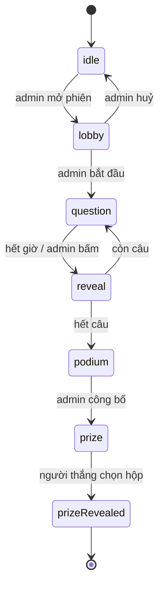

# Kế hoạch thiết kế — Open Day Quiz

Tài liệu này liệt kê **các trang và tính năng cần làm**, thứ tự làm, và những gì còn phải quyết. Chưa có code nào cho phần này.

Nguồn: [README.md](../README.md) (spec sản phẩm). Luật viết code: `CLAUDE.md`.

---

## 1. Ý tưởng trung tâm: một máy trạng thái, ba cách vẽ

Đây là quyết định thiết kế quan trọng nhất, và nó chi phối mọi thứ còn lại.

Ba màn hình (admin / player / display) **không phải ba ứng dụng**. Chúng cùng nhìn vào **một trạng thái phiên chơi duy nhất**, chỉ khác nhau ở chỗ vẽ trạng thái đó ra thế nào:

| Trạng thái | Admin thấy | Player thấy | Display thấy |
| --- | --- | --- | --- |
| `lobby` | Danh sách người vào, nút Bắt đầu | "Đang chờ..." + tên mình | QR to + số người chơi |
| `question` | Câu hỏi + số người đã trả lời | 4 ô đáp án bấm được | Câu hỏi chữ rất to + đồng hồ |
| `reveal` | Nút Câu tiếp | Đúng/sai + điểm mình | Đáp án đúng + phân bố lựa chọn |
| `podium` | Nút Công bố người thắng | Hạng của mình | Top 3 |
| `prize` | Chờ | 3 hộp để chọn (chỉ người thắng) | 3 hộp + animation mở |

Hệ quả: **máy trạng thái này là một model dùng chung**, không thuộc riêng surface nào. Nó sẽ nằm ở `src/common/session/`. Ba surface chỉ là ba bộ view + controller đọc nó.

---

## 2. Trang cần thiết

Tổng cộng **5 route**, 11 màn hình.

### 2.1 Admin — `features/admin/`

| # | Trang | Route | Nội dung |
| --- | --- | --- | --- |
| A1 | Danh sách quiz | `/admin` | Bảng các bộ quiz, nút Tạo / Sửa / Xoá / Nhân bản |
| A2 | Soạn quiz | `/admin/quiz/:id` | Tên bộ quiz; thêm/sửa/xoá câu hỏi; mỗi câu: nội dung, 2–4 đáp án, đánh dấu đáp án đúng, thời gian đếm ngược |
| A3 | Bàn điều khiển | `/admin/live` | QR + link tham gia; danh sách người đang kết nối; nút Bắt đầu / Câu tiếp / Hiện đáp án / Kết thúc; leaderboard; nút Công bố người thắng |

A3 là trang quan trọng nhất và cũng dễ sai nhất — nó là cái duy nhất được phép **đổi trạng thái phiên**. Player và display chỉ đọc.

### 2.2 Player — `features/player/`

Một route `/play`, nội dung đổi theo trạng thái phiên. Điện thoại, ngón tay, cầm dọc.

| # | Màn hình | Khi nào |
| --- | --- | --- |
| P1 | Nhập tên tham gia | vào từ QR, chưa có tên |
| P2 | Chờ ở lobby | đã có tên, phiên chưa bắt đầu |
| P3 | Trả lời câu hỏi | `question` — 4 ô to, đồng hồ, bấm xong thì khoá và chờ |
| P4 | Đúng/sai + điểm | `reveal` |
| P5 | Hạng của mình | `podium` |
| P6 | Chọn hộp quà | `prize`, **chỉ người thắng**; người khác thấy màn hình chờ |

### 2.3 Display — `features/display/`

Một route `/display`, nội dung đổi theo trạng thái phiên. Máy chiếu, xem từ xa 10m, không ai bấm gì.

| # | Màn hình | Khi nào |
| --- | --- | --- |
| D1 | QR khổng lồ + số người đã vào | `lobby` |
| D2 | Câu hỏi + đáp án + đồng hồ đếm ngược | `question` |
| D3 | Đáp án đúng + leaderboard trực tiếp | `reveal` |
| D4 | Người thắng / top 3 | `podium` |
| D5 | 3 hộp quà + animation mở quà | `prize`, `prizeRevealed` |

---

## 3. Dữ liệu

Đặt ở `common/session/models/` vì cả ba surface đều đọc.

| Thực thể | Trường | Ghi chú |
| --- | --- | --- |
| `Quiz` | `id`, `title`, `questions[]` | Admin tạo, tồn tại giữa các phiên |
| `Question` | `id`, `prompt`, `options[]`, `correctIndex`, `durationSeconds` | Mở rộng từ [Question.js](../src/features/quiz/models/Question.js) hiện có, thêm `durationSeconds` |
| `Session` | `id`, `quizId`, `state`, `currentIndex`, `questionEndsAt` | Một phiên chơi; `state` là máy trạng thái ở mục 1 |
| `Player` | `id`, `name`, `joinedAt`, `score` | `id` sinh ở client, lưu `localStorage` để refresh không mất chỗ |
| `Answer` | `playerId`, `questionId`, `optionIndex`, `msTaken` | `msTaken` cần cho điểm theo tốc độ |
| `PrizeBoxes` | `boxes[]` (hoán vị của prize), `pickedIndex` | Xáo lại mỗi phiên |

### Hai chi tiết kỹ thuật dễ sai

**Đồng hồ đếm ngược:** đừng cho mỗi máy tự đếm từ N giây. Lưu **mốc thời điểm kết thúc** (`questionEndsAt`) trong session, mỗi máy tự tính `còn lại = questionEndsAt - now`. Nếu để mỗi máy đếm độc lập, sau vài câu điện thoại và máy chiếu sẽ lệch nhau vài giây, và người chơi sẽ khiếu nại.

**Vào lại giữa game:** điện thoại rất dễ bị lock màn hình hoặc refresh. `playerId` phải lưu `localStorage` để vào lại là nhận lại đúng tên và điểm, không tạo người chơi mới.

---

## 4. Tính năng theo lớp MVC

Mỗi feature theo khung `models/ controllers/ views/` như CLAUDE.md quy định.

| Feature | Model (luật) | Controller | View |
| --- | --- | --- | --- |
| `common/session` | máy trạng thái, chuyển trạng thái hợp lệ, `questionEndsAt` | `useSession()` — đọc phiên, subscribe | — |
| `admin` | validate bộ quiz (≥1 câu, có đáp án đúng) | `useQuizEditorController`, `useControlController` | A1, A2, A3 |
| `player` | — (đọc session) | `usePlayerController` — join, gửi đáp án | P1–P6 |
| `display` | — (đọc session) | `useDisplayController` | D1–D5 |
| `leaderboard` | tính điểm, sắp hạng, xử lý đồng điểm | `useLeaderboard` | bảng hạng (3 cỡ: điện thoại / admin / máy chiếu) |
| `prizes` | xáo vị trí quà, chốt hộp đã chọn | `usePrizeController` | 3 hộp + reveal |

`features/quiz/` hiện tại đổi tên thành `features/player/` khi tới Phase 2; `Question.js` và phần chấm điểm chuyển sang `common/session/`.

---

## 5. Thứ tự làm

Nguyên tắc: mỗi phase kết thúc phải **demo được**, và **hoãn quyết định realtime càng lâu càng tốt**.

| Phase | Nội dung | Cỡ | Demo được gì |
| --- | --- | --- | --- |
| **0. Nền** | Routing 5 route; máy trạng thái `common/session`; repository phiên chạy bằng bộ nhớ/`localStorage` | M | Bấm qua đủ 3 surface bằng dữ liệu giả, một máy |
| **1. Soạn quiz** | A1 + A2, lưu `localStorage` | M | Tạo được bộ quiz thật |
| **2. Vòng chơi một máy** | A3 + P1–P4 + D1–D3, chạy chung một tab | L | Chơi trọn một lượt, chưa cần mạng |
| **3. Realtime** | Cắm transport đã chọn vào repository | L | Điện thoại thật + máy chiếu thật đồng bộ |
| **4. Điểm & leaderboard** | Chấm điểm theo tốc độ, hạng, đồng điểm, P5 + D4 | M | Có người thắng |
| **5. Hộp quà** | Xáo quà, P6 + D5, animation mở | S | Trọn kịch bản tới lúc trao quà |
| **6. Hoàn thiện** | Sinh QR, cỡ chữ cho máy chiếu, responsive, `docs/installation.md` + `docs/usage.md` | M | Bản giao được |

Điểm mấu chốt của thứ tự này: **Phase 0–2 làm được mà không cần biết sẽ chọn Firebase hay Socket.IO**, vì repository là lớp cách ly. Đến Phase 3 mới cần quyết. Nếu chọn sai ở Phase 3 thì cũng chỉ sửa lại repository.

---

## 6. Còn phải quyết

| # | Việc | Khi nào cần | Đề xuất |
| --- | --- | --- | --- |
| 1 | **Realtime**: Firebase/Supabase hay Node + Socket.IO tự dựng | Phase 3 | Phụ thuộc wifi hội trường. Mạng không tin được → server LAN tự dựng |
| 2 | **Routing**: react-router hay tự switch trên `location.hash` | Phase 0 | Hash tự viết (~15 dòng), khỏi cấu hình SPA fallback, QR không bị 404 |
| 3 | **Thư viện QR** | Phase 6 (hoặc sớm hơn để test) | `qrcode.react` — nhỏ, render SVG đen trắng đúng luật layout |
| 4 | **Cách chấm điểm** | Phase 4 | Đúng = điểm cơ bản + thưởng theo tốc độ. Nếu chỉ 1 điểm/câu thì với ~5 câu sẽ đồng điểm hàng loạt, không chọn ra được **một** người thắng |
| 5 | **Đồng điểm ở ngôi nhất** | Phase 4 | Hơn nhau ở tổng thời gian trả lời; vẫn bằng thì admin bấm chọn |
| 6 | **Nội dung câu hỏi thật** | Trước sự kiện | Không phải việc code — cần người của trường soạn |
| 7 | **Quà thật** | Trước sự kiện | README ví dụ: Course Magnet, FabLab Sticker, 3D Printed Figure |

---

## 7. Không làm (giữ đúng phạm vi prototype)

README nói rõ *"do not over-engineer"*, nên chốt trước những thứ **sẽ không làm**, để khỏi bị kéo phạm vi:

- Không đăng nhập, không tài khoản, không phân quyền — trang admin chỉ cần biết URL. (Rủi ro chấp nhận được: ai biết `/admin/live` thì điều khiển được game. Nếu cần, thêm một mã PIN gõ tay là đủ.)
- Không lưu lịch sử các phiên đã chơi, không thống kê, không xuất báo cáo.
- Không nhiều phiên chạy song song — một lúc một phiên.
- Không ảnh/video trong câu hỏi, chỉ chữ.
- Không đa ngôn ngữ, không chế độ khán giả, không app mobile.
- Không viết test tự động cho prototype; nghiệm thu bằng cách chạy thử trọn kịch bản.

---

## 8. Việc cần thử trước sự kiện

Không phải code, nhưng thiếu là vỡ trận:

- Chạy thử với **số điện thoại thật** ở gần mức dự kiến, trên **wifi thật của hội trường**.
- Nhìn máy chiếu từ hàng ghế cuối — chữ ở D2 có đọc được không.
- Thử tình huống một điện thoại tắt màn hình giữa câu rồi mở lại.
- Thử admin bấm "câu tiếp" hai lần liên tiếp (máy trạng thái phải chặn).
- Chuẩn bị phương án dự phòng nếu mạng chết giữa game.
