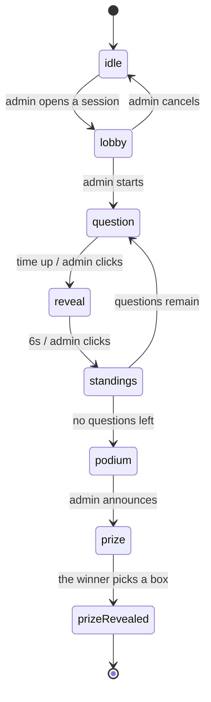

# Design plan — Open Day Quiz

This document lists **the pages and features to build**, the order to build them
in, and what still has to be decided.

Source: [README.md](../README.md) (the product spec). Coding rules: `CLAUDE.md`.

**Status:** all 8 phases are done (0 → 7). Phase 3 settled on a **self-hosted Node
server on the LAN**, SSE + intents, no added dependencies. The architecture is
written up in [architecture.md](architecture.md); how to run it is in
[installation.md](installation.md) and [usage.md](usage.md).

---

## 1. The central idea: one state machine, three ways to draw it

This is the most important design decision, and it governs everything else.

The three screens (admin / player / display) **are not three applications**. They
all look at **one single session state**, differing only in how they draw it:

| State | Admin sees | Player sees | Display sees |
| --- | --- | --- | --- |
| `lobby` | The join list, Start button | "Waiting..." + their name | Large QR + player count |
| `question` | The question + how many answered | 4 tappable option tiles | The question in huge type + clock |
| `reveal` | Show standings button | Right/wrong + their points | The correct answer + pick distribution |
| `standings` | The top 10, Next question button | The top 10 + their own rank | The top 10, moving |
| `podium` | Announce winner button | Their own rank | Top 3 |
| `prize` | Waiting | 3 boxes to pick from (winner only) | 3 boxes + the opening animation |

The consequence: **this state machine is a shared model**, belonging to no single
surface. It lives in `src/common/session/`. The three surfaces are just three sets
of views and controllers reading it.

---

## 2. Pages needed

**6 routes** in total, 12 screens.

### 2.0 Home page — `features/home/`

| # | Page | Route | Content |
| --- | --- | --- | --- |
| H1 | Home | `/` | Introduces the game, the three steps, a prize-box teaser, and links to all three screens. Reads the session to show live status ("The lobby is open", the join count) — read-only, sends no intents |

### 2.1 Admin — `features/admin/`

| # | Page | Route | Content |
| --- | --- | --- | --- |
| A1 | Quiz list | `/admin` | The table of quizzes, with New / Edit / Delete / Duplicate |
| A2 | Quiz editor | `/admin/quiz/:id` | Quiz title; add/edit/delete questions; per question: text, illustration image, 2–4 options (text and/or image), mark the correct answer, countdown duration |
| A3 | Control desk | `/admin/live` | QR + join link; the list of connected players; Start / Next question / Reveal answer / End buttons; an **Auto** toggle (on by default) that walks the round to the final results by itself; the leaderboard; the Announce winner button |

A3 is the most important page and the easiest to get wrong — it is the only one
allowed to **change the session state**. Player and display only read.

### 2.2 Player — `features/player/`

One route `/play`, whose content changes with the session state. Phone, thumbs,
held portrait.

| # | Screen | When |
| --- | --- | --- |
| P1 | Enter a name to join | arrived from the QR, no name yet |
| P2 | Waiting in the lobby | has a name, session not started; the only screen with a way back to P1 |
| P3 | Answering a question | `question` — 4 large tiles, a clock, locks after tapping |
| P4 | Right/wrong + points | `reveal` |
| P4b | The top 10 with the rank change | `standings` |
| P5 | Their own rank | `podium` |
| P6 | Pick a prize box | `prize`, **winner only**; everyone else gets a waiting screen |

### 2.3 Display — `features/display/`

One route `/display`, whose content changes with the session state. Projector,
viewed from 10 metres. The one thing clickable on it is **Start the quiz** on
D1 — the host is usually standing at the screen, not at the laptop.

| # | Screen | When |
| --- | --- | --- |
| D1 | Giant QR + the join count + a Start button | `lobby` |
| D2 | The question, options and countdown | `question` |
| D3 | The correct answer + the pick distribution | `reveal` |
| D3b | The top 10 with the rank change, alone on the screen | `standings` |
| D4 | The winner / top 3 | `podium` |
| D5 | 3 prize boxes + the opening animation | `prize`, `prizeRevealed` |

---

## 3. Data

Placed in `common/session/models/` because all three surfaces read it.

| Entity | Fields | Notes |
| --- | --- | --- |
| `Quiz` | `id`, `title`, `questions[]` | Created by the admin, outlives individual sessions |
| `Question` | `id`, `prompt`, `options[]`, `correctIndex`, `durationSeconds` | [Question.js](../src/common/session/models/Question.js) |
| `Session` | `id`, `quiz`, `state`, `currentIndex`, `questionEndsAt` | One game session; `state` is the machine from section 1. `id` is minted on every `openLobby` and is what makes phones join afresh each session |
| `Player` | `id`, `name`, `avatarId`, `joinedAt`, `score` | `id` generated on the client, stored in `localStorage` with the avatar **and the session id** — a refresh keeps your place, a new session starts a new person. `avatarId` is **unique within a session**, first come first served, which caps a round at one player per animal |
| `Answer` | `playerId`, `questionId`, `optionIndex`, `msTaken` | `msTaken` is what speed scoring needs |
| `PrizeBoxes` | `prizeIds[]` (a permutation of the prize catalogue), `pickedIndex` | Reshuffled every session. A prize is `{ id, name, description }`; only the id travels in the session state |

### Two technical details that are easy to get wrong

**The countdown:** do not let each device count down from N seconds on its own.
Store the **end timestamp** (`questionEndsAt`) in the session and let each device
compute `remaining = questionEndsAt - now`. Counting independently makes the
phones and the projector drift seconds apart after a few questions, and players
will complain.

**Rejoining mid-game:** phones get their screen locked or refreshed all the time.
`playerId` has to live in `localStorage` so rejoining restores the same name and
score instead of creating a new player — but stamped with the session id, so it
only counts for the round it was created in. One phone at a stand is played by a
stream of different visitors, and the next one must not inherit the last one's
name, animal and seat.

The same reload means the opposite **before** the game starts, where there is no
score to protect: it hands the seat back so a mistyped name or a regretted animal
can be redone, which the **Change name or animal** button on P2 also does.

---

## 4. Features by MVC layer

Each feature follows the `models/ controllers/ views/` frame that CLAUDE.md
prescribes.

The table below is the **actual outcome after building**, with two deviations from
the original plan — noted underneath.

| Feature | Model (rules) | Controller | View |
| --- | --- | --- | --- |
| `common/session` | `SessionModel` (state machine, `questionEndsAt`), `Quiz`, `Question`, `Leaderboard`, `PrizeBoxes`, `SessionRepository` | `useSession`, `useNow`, `useCountUp` | — |
| `common/views` | — | — | `Button`, `Countdown`, `ProgressBar`, `LeaderboardTable`, `StandingsBoard`, `ScoreCounter`, `JoinQr`, `ConnectionBanner`, `PlayerAvatar` |
| `admin` | `QuizRepository`, `AdminAuthRepository` + sample data | `useQuizListController`, `useQuizEditorController`, `useLiveController`, `useAdminAuthController` | A1, A2, A3, `AdminGate` |
| `player` | — (reads the session) | `usePlayerController` — join, submit answers, pick a prize box | P1–P6 |
| `display` | — (reads the session) | `useDisplayController` — reads, plus the one `start` intent from D1 | D1–D5 |

**Deviation 1 — no separate `leaderboard` and `prizes` features.** Scoring rules
and prize shuffling are read by all three surfaces, so by CLAUDE.md's own rule
they belong in `common/session/models/` (`Leaderboard.js`, `PrizeBoxes.js`). The
views, meanwhile, are completely different per surface (a prize box is a button on
a phone and a static, large-type shape on the projector), so they cannot be pooled
into one feature. Splitting them out would only add a layer without removing a
line of code.

**Deviation 3 — there is a `server/`, outside `src/`.** The game server belongs to
no feature and is not MVC: it is a set of files (`index.js`, `sessionApi.js`,
`sessionStore.js`) importing the client's `SessionModel.js` directly. Because the
model never imports React and never calls `Date.now()` itself, the game rules need
only one copy, and it runs in node too.

**Deviation 2 — `features/quiz/` was dropped, not renamed.** The old single-player
demo had its own model and controller which could not be reused once the state
became a shared session. Its presentational components were rewritten to suit
phones (larger tap targets, plus a "picked but not yet revealed" state).

---

## 5. Build order

The principle: every phase has to end in something **demoable**, and **the
realtime decision is deferred as long as possible**.

| Phase | Content | Status |
| --- | --- | --- |
| **0. Foundations** | 5-route routing; the `common/session` state machine; a session repository backed by `localStorage` | ✅ done |
| **1. Quiz editing** | A1 + A2, autosaved after every change | ✅ done — storage later moved from `localStorage` to `server/quizzes.json`, so a quiz belongs to the event rather than to one browser |
| **2. Single-machine round** | A3 + P1–P4 + D1–D3 | ✅ done — works across several tabs on one machine, not just one tab |
| **3. Realtime** | A Node server on the LAN holding the state; `SessionRepository` switched to SSE + POST intents | ✅ done |
| **4. Scoring & leaderboard** | Speed-based scoring, ranks, ties, P5 + D4 | ✅ done — a `standings` step showing the top 10 with the rank change and a climbing score was added between the answer and the next question afterwards |
| **5. Prize boxes** | Shuffling, P6 + D5, the opening animation | ✅ done |
| **6. Polish** | Real QR codes (`qrcode.react`), projector type sizes, `docs/installation.md` + `docs/usage.md` + `docs/architecture.md` | ✅ done |
| **7. Player avatars** | 50 Lottie animals to pick from when joining, one per player per round, shown on the lobby wall, the leaderboard and next to the winner | ✅ done — see `docs/credits.md` |
| **8. Admin password** | One password for the event, set on first run and stored as a scrypt hash in `.env`; `AdminGate` in front of A1–A3, token required to write a quiz or upload an image | ✅ done — see the admin password section of `docs/architecture.md` |

The crux of this ordering held up in practice: **every other phase was completed
without knowing which transport would be chosen**, because `SessionRepository` is
the isolating layer.

Phase 3 is done, and this is where the original prediction was not quite right:
**`SessionModel` and every view really did need zero changes**, but
`SessionRepository` was not the only thing that changed. These also had to change:

- `useSession` returns `send(intent)` instead of `update(fn)` — clients no longer
  apply the rules themselves, so the 11 call sites across three controllers each
  changed by one line.
- Auto-closing a question when time is up moved from `useLiveController` to the
  server: there must be exactly one clock, and the game must not hang when the
  admin locks their screen. The same tick later grew **auto mode**
  (`setAutoAdvance` + `autoStepEndsAt`), on by default, which holds a revealed
  answer for 6 seconds and the standings after it for 8, then moves on — up to
  the final results but no further.
- Added an `isOffline` flag plus the disconnect banner. No loading flag was
  needed: `read()` is still synchronous, it just reads the latest snapshot.
- The player resends `join` when the session no longer knows their name (after a
  server restart).

---

## 6. Still to decide

### Open

| # | Item | Notes |
| --- | --- | --- |
| 6 | **The real question content** | Not a coding task — the university needs to write it and type it into the admin page. There is a 5-question sample set for now |
| 7 | **The real prizes** | Names are exactly the examples from the README; the one-line descriptions shown when a box opens are placeholders. Edit the `PRIZES` constant in `PrizeBoxes.js` |

### Settled during the build

| # | Item | Decision | Why |
| --- | --- | --- | --- |
| 2 | **Routing** | Hand-written on `location.hash`, ~60 lines in `common/routing/useHashRoute.js` | Avoids react-router, avoids SPA fallback configuration, and the QR code never lands on a 404 |
| 3 | **QR library** | `qrcode.react`, rendering SVG | Stays crisp blown up on a projector, and defaults to black on white, which fits the layout rules |
| 4 | **Scoring** | Correct = 1000 points + a speed bonus of up to 500, decreasing linearly with time used | With ~5 questions, 1 point per question produces mass ties and no way to pick **one** winner to award a prize to |
| 5 | **Ties for first place** | Broken by total answering time. Equal on both means both share first place, and the control desk lists them so the admin can click who gets the prize | Handles nearly every case automatically; only an exact tie needs a human |
| 8 | **Who the winner is** | `winnerId` is stored in the session at announcement time, not derived from the leaderboard | The prize step needs to know exactly whose it is, and it lets the admin pick manually on a tie |
| 1 | **Realtime** | A self-hosted Node server on the LAN (`node:http`, no dependencies), SSE `/api/events` + `POST /api/intent`, the server as source of truth | The project owner decided visitors share the wifi with the computer. No internet needed, no data leaves the room. SSE because `EventSource` reconnects itself — a phone that locks and unlocks its screen rejoins on its own; Socket.IO adds ~40 kB for bidirectional traffic this app does not use |
| 9 | **Source of truth** | The server applies the rules, clients only send intents | With direct client writes, one phone could POST a fabricated session; and `msTaken` has to be measured by one clock, otherwise whoever has the slowest clock gets bonus points |

---

## 7. Out of scope (staying a prototype)

The README says plainly *"do not over-engineer"*, so here is what **will not be
built**, decided up front to prevent scope creep:

- No accounts and no roles — **one** password for the whole event, set the first
  time somebody opens the admin page and kept as a scrypt hash in `.env`. It
  gates the three admin pages and every admin write on the server. (The accepted
  risk that remains: the intents driving a live round travel the open channel the
  phones use, so they are not password-checked — see the admin password section
  of [architecture.md](architecture.md).)
- No history of past sessions, no statistics, no report export.
- No parallel sessions — one at a time.
- No video in questions. **Images yes** (both the question and each option can
  carry one) — this decision changed from the original plan; images live on the
  server and the quiz only stores the path, see the realtime section of
  [architecture.md](architecture.md).
- No internationalisation, no spectator mode, no mobile app.
- No automated tests for a prototype; acceptance is running the whole scenario by
  hand.

---

## 8. To test before the event

Not code, but skipping it breaks the event:

- Run a rehearsal with **real phones** at roughly the expected count, on **the
  actual venue wifi**. The first thing to test: does that wifi let phones talk to
  the laptop (client isolation is risk number one), and has the macOS firewall
  been told to Allow node.
- Look at the projector from the back row — is the text on D2 readable and the QR
  code on D1 scannable.
- Test a phone locking its screen mid-question and coming back.
- ✅ Admin pressing "next question" twice in a row: the state machine blocks it,
  already tested.
- Prepare a fallback in case the network dies mid-game.
- Remember to open every screen with the **IP address** `npm run start` prints,
  not `localhost`, or the QR code is useless.
- Bring a travel router or have a phone hotspot ready, in case the venue wifi
  blocks devices from seeing each other.
