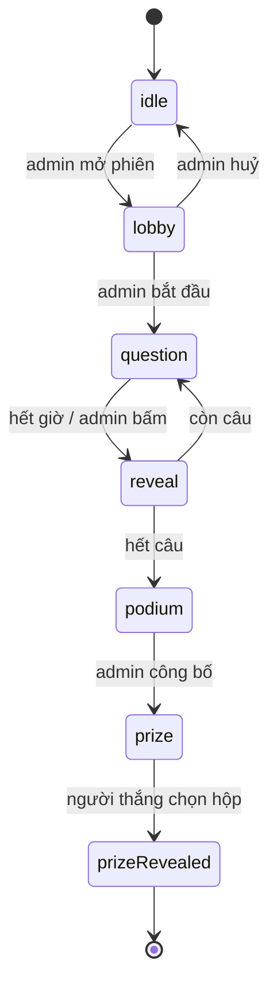

# Kế hoạch thiết kế — Open Day Quiz

Tài liệu này liệt kê **các trang và tính năng cần làm**, thứ tự làm, và những gì còn phải quyết.

Nguồn: [README.md](../README.md) (spec sản phẩm). Luật viết code: `CLAUDE.md`.

**Tình trạng:** Phase 0, 1, 2, 4, 5, 6 đã xong. Chỉ còn **Phase 3 (realtime)** vì
nó chờ chủ dự án chốt transport. Kiến trúc đã dựng xong được ghi ở
[architecture.md](architecture.md); cách chạy ở [installation.md](installation.md)
và [usage.md](usage.md).

---

## 1. Ý tưởng trung tâm: một máy trạng thái, ba cách vẽ

Đây là quyết định thiết kế quan trọng nhất, và nó chi phối mọi thứ còn lại.

Ba màn hình (admin / player / display) **không phải ba ứng dụng**. Chúng cùng nhìn vào **một trạng thái phiên chơi duy nhất**, chỉ khác nhau ở chỗ vẽ trạng thái đó ra thế nào:

| Trạng thái | Admin thấy | Player thấy | Display thấy |
| --- | --- | --- | --- |
| `lobby` | Danh sách người vào, nút Bắt đầu | "Đang chờ..." + tên mình | QR to + số người chơi |
| `question` | Câu hỏi + số người đã trả lời | 4 ô đáp án bấm được | Câu hỏi chữ rất to + đồng hồ |
| `reveal` | Nút Câu tiếp | Đúng/sai + điểm mình | Đáp án đúng + phân bố lựa chọn |
| `podium` | Nút Công bố người thắng | Hạng của mình | Top 3 |
| `prize` | Chờ | 3 hộp để chọn (chỉ người thắng) | 3 hộp + animation mở |

Hệ quả: **máy trạng thái này là một model dùng chung**, không thuộc riêng surface nào. Nó sẽ nằm ở `src/common/session/`. Ba surface chỉ là ba bộ view + controller đọc nó.

---

## 2. Trang cần thiết

Tổng cộng **5 route**, 11 màn hình.

### 2.1 Admin — `features/admin/`

| # | Trang | Route | Nội dung |
| --- | --- | --- | --- |
| A1 | Danh sách quiz | `/admin` | Bảng các bộ quiz, nút Tạo / Sửa / Xoá / Nhân bản |
| A2 | Soạn quiz | `/admin/quiz/:id` | Tên bộ quiz; thêm/sửa/xoá câu hỏi; mỗi câu: nội dung, 2–4 đáp án, đánh dấu đáp án đúng, thời gian đếm ngược |
| A3 | Bàn điều khiển | `/admin/live` | QR + link tham gia; danh sách người đang kết nối; nút Bắt đầu / Câu tiếp / Hiện đáp án / Kết thúc; leaderboard; nút Công bố người thắng |

A3 là trang quan trọng nhất và cũng dễ sai nhất — nó là cái duy nhất được phép **đổi trạng thái phiên**. Player và display chỉ đọc.

### 2.2 Player — `features/player/`

Một route `/play`, nội dung đổi theo trạng thái phiên. Điện thoại, ngón tay, cầm dọc.

| # | Màn hình | Khi nào |
| --- | --- | --- |
| P1 | Nhập tên tham gia | vào từ QR, chưa có tên |
| P2 | Chờ ở lobby | đã có tên, phiên chưa bắt đầu |
| P3 | Trả lời câu hỏi | `question` — 4 ô to, đồng hồ, bấm xong thì khoá và chờ |
| P4 | Đúng/sai + điểm | `reveal` |
| P5 | Hạng của mình | `podium` |
| P6 | Chọn hộp quà | `prize`, **chỉ người thắng**; người khác thấy màn hình chờ |

### 2.3 Display — `features/display/`

Một route `/display`, nội dung đổi theo trạng thái phiên. Máy chiếu, xem từ xa 10m, không ai bấm gì.

| # | Màn hình | Khi nào |
| --- | --- | --- |
| D1 | QR khổng lồ + số người đã vào | `lobby` |
| D2 | Câu hỏi + đáp án + đồng hồ đếm ngược | `question` |
| D3 | Đáp án đúng + leaderboard trực tiếp | `reveal` |
| D4 | Người thắng / top 3 | `podium` |
| D5 | 3 hộp quà + animation mở quà | `prize`, `prizeRevealed` |

---

## 3. Dữ liệu

Đặt ở `common/session/models/` vì cả ba surface đều đọc.

| Thực thể | Trường | Ghi chú |
| --- | --- | --- |
| `Quiz` | `id`, `title`, `questions[]` | Admin tạo, tồn tại giữa các phiên |
| `Question` | `id`, `prompt`, `options[]`, `correctIndex`, `durationSeconds` | [Question.js](../src/common/session/models/Question.js) |
| `Session` | `id`, `quizId`, `state`, `currentIndex`, `questionEndsAt` | Một phiên chơi; `state` là máy trạng thái ở mục 1 |
| `Player` | `id`, `name`, `joinedAt`, `score` | `id` sinh ở client, lưu `localStorage` để refresh không mất chỗ |
| `Answer` | `playerId`, `questionId`, `optionIndex`, `msTaken` | `msTaken` cần cho điểm theo tốc độ |
| `PrizeBoxes` | `boxes[]` (hoán vị của prize), `pickedIndex` | Xáo lại mỗi phiên |

### Hai chi tiết kỹ thuật dễ sai

**Đồng hồ đếm ngược:** đừng cho mỗi máy tự đếm từ N giây. Lưu **mốc thời điểm kết thúc** (`questionEndsAt`) trong session, mỗi máy tự tính `còn lại = questionEndsAt - now`. Nếu để mỗi máy đếm độc lập, sau vài câu điện thoại và máy chiếu sẽ lệch nhau vài giây, và người chơi sẽ khiếu nại.

**Vào lại giữa game:** điện thoại rất dễ bị lock màn hình hoặc refresh. `playerId` phải lưu `localStorage` để vào lại là nhận lại đúng tên và điểm, không tạo người chơi mới.

---

## 4. Tính năng theo lớp MVC

Mỗi feature theo khung `models/ controllers/ views/` như CLAUDE.md quy định.

Bảng dưới là **tình trạng thật sau khi làm**, có hai chỗ lệch với dự kiến ban đầu — ghi rõ ở dưới bảng.

| Feature | Model (luật) | Controller | View |
| --- | --- | --- | --- |
| `common/session` | `SessionModel` (máy trạng thái, `questionEndsAt`), `Quiz`, `Question`, `Leaderboard`, `PrizeBoxes`, `SessionRepository` | `useSession`, `useNow` | — |
| `common/views` | — | — | `Button`, `Countdown`, `ProgressBar`, `LeaderboardTable`, `JoinQr` |
| `admin` | `QuizRepository` + dữ liệu mẫu | `useQuizListController`, `useQuizEditorController`, `useLiveController` | A1, A2, A3 |
| `player` | — (đọc session) | `usePlayerController` — join, gửi đáp án, chọn hộp quà | P1–P6 |
| `display` | — (đọc session) | `useDisplayController` | D1–D5 |

**Lệch 1 — không có feature `leaderboard` và `prizes` riêng.** Luật chấm điểm và xáo quà là thứ cả ba surface đều đọc, nên theo đúng luật của CLAUDE.md nó thuộc `common/session/models/` (`Leaderboard.js`, `PrizeBoxes.js`). Còn view thì mỗi surface một kiểu hẳn (hộp quà trên điện thoại là nút bấm, trên máy chiếu là hình tĩnh chữ to), nên không gom được thành một feature. Tách riêng chỉ tạo thêm tầng mà không giảm được dòng code nào.

**Lệch 2 — `features/quiz/` bị bỏ, không phải đổi tên.** Bản demo một người chơi cũ có model và controller riêng, không dùng lại được khi trạng thái chuyển sang session dùng chung. Các component trình bày thì viết lại cho vừa điện thoại (vùng bấm to hơn, thêm trạng thái "đã chọn nhưng chưa lộ đáp án").

---

## 5. Thứ tự làm

Nguyên tắc: mỗi phase kết thúc phải **demo được**, và **hoãn quyết định realtime càng lâu càng tốt**.

| Phase | Nội dung | Tình trạng |
| --- | --- | --- |
| **0. Nền** | Routing 5 route; máy trạng thái `common/session`; repository phiên chạy bằng `localStorage` | ✅ xong |
| **1. Soạn quiz** | A1 + A2, lưu `localStorage`, tự lưu sau mỗi thay đổi | ✅ xong |
| **2. Vòng chơi một máy** | A3 + P1–P4 + D1–D3 | ✅ xong — chạy được nhiều tab trên cùng máy, không chỉ một tab |
| **3. Realtime** | Cắm transport đã chọn vào `SessionRepository` | ⏸ chờ chốt transport |
| **4. Điểm & leaderboard** | Chấm điểm theo tốc độ, hạng, đồng điểm, P5 + D4 | ✅ xong |
| **5. Hộp quà** | Xáo quà, P6 + D5, animation mở | ✅ xong |
| **6. Hoàn thiện** | Mã QR thật (`qrcode.react`), cỡ chữ máy chiếu, `docs/installation.md` + `docs/usage.md` + `docs/architecture.md` | ✅ xong |

Điểm mấu chốt của thứ tự này đã được kiểm chứng: **mọi phase khác làm xong mà không cần biết sẽ chọn Firebase hay Socket.IO**, vì `SessionRepository` là lớp cách ly. Phase 3 chỉ đổi đúng file đó — `SessionModel` và toàn bộ view không phải sửa.

Phase 3 khi làm sẽ cần: đổi `read()/update()/subscribe()` thành `async`, thêm cờ loading/lỗi ở controller, và quyết ai là "nguồn sự thật" khi hai admin bấm cùng lúc (hiện chỉ có một bàn điều khiển nên chưa phải lo).

---

## 6. Còn phải quyết

### Còn treo

| # | Việc | Ghi chú |
| --- | --- | --- |
| 1 | **Realtime**: Firebase/Supabase hay Node + Socket.IO tự dựng | **Quyết định của chủ dự án.** Phụ thuộc wifi hội trường: mạng không tin được → server LAN tự dựng. Đây là thứ duy nhất chặn Phase 3 |
| 6 | **Nội dung câu hỏi thật** | Không phải việc code — cần người của trường soạn, gõ thẳng vào trang admin. Hiện có một bộ mẫu 5 câu |
| 7 | **Quà thật** | Đang dùng đúng ví dụ trong README. Sửa hằng `PRIZES` trong `PrizeBoxes.js` |

### Đã chốt khi làm

| # | Việc | Chốt thế nào | Vì sao |
| --- | --- | --- | --- |
| 2 | **Routing** | Tự viết trên `location.hash`, ~60 dòng ở `common/routing/useHashRoute.js` | Khỏi thêm react-router, khỏi cấu hình SPA fallback, và QR không bao giờ ra 404 |
| 3 | **Thư viện QR** | `qrcode.react`, render SVG | Nét khi phóng lên máy chiếu, mặc định đen trên trắng nên đúng luật layout |
| 4 | **Cách chấm điểm** | Đúng = 1000 điểm + thưởng tốc độ tối đa 500, giảm dần đều theo thời gian đã dùng | Với ~5 câu, chấm 1 điểm/câu thì đồng điểm hàng loạt, không chọn ra được **một** người thắng để trao quà |
| 5 | **Đồng điểm ở ngôi nhất** | Hơn nhau ở tổng thời gian trả lời. Bằng cả hai thì cùng hạng nhất, và bàn điều khiển hiện danh sách để admin bấm chọn người nhận quà | Tự động xử lý được gần hết trường hợp, chỉ trường hợp bằng nhau tuyệt đối mới cần người quyết |
| 8 | **Ai là người thắng** | Lưu `winnerId` vào session lúc công bố, không suy ra từ bảng hạng | Bước chọn quà cần biết chắc của ai; và cho phép admin chọn tay khi đồng hạng |

---

## 7. Không làm (giữ đúng phạm vi prototype)

README nói rõ *"do not over-engineer"*, nên chốt trước những thứ **sẽ không làm**, để khỏi bị kéo phạm vi:

- Không đăng nhập, không tài khoản, không phân quyền — trang admin chỉ cần biết URL. (Rủi ro chấp nhận được: ai biết `/admin/live` thì điều khiển được game. Nếu cần, thêm một mã PIN gõ tay là đủ.)
- Không lưu lịch sử các phiên đã chơi, không thống kê, không xuất báo cáo.
- Không nhiều phiên chạy song song — một lúc một phiên.
- Không ảnh/video trong câu hỏi, chỉ chữ.
- Không đa ngôn ngữ, không chế độ khán giả, không app mobile.
- Không viết test tự động cho prototype; nghiệm thu bằng cách chạy thử trọn kịch bản.

---

## 8. Việc cần thử trước sự kiện

Không phải code, nhưng thiếu là vỡ trận:

- Chạy thử với **số điện thoại thật** ở gần mức dự kiến, trên **wifi thật của hội trường**. *(Cần Phase 3 trước — hiện chỉ đồng bộ giữa các tab trên cùng một máy.)*
- Nhìn máy chiếu từ hàng ghế cuối — chữ ở D2 và mã QR ở D1 có đọc/quét được không.
- Thử tình huống một điện thoại tắt màn hình giữa câu rồi mở lại.
- ✅ Admin bấm "câu tiếp" hai lần liên tiếp: máy trạng thái đã chặn, đã thử.
- Chuẩn bị phương án dự phòng nếu mạng chết giữa game.
- Nhớ mở mọi màn hình bằng **địa chỉ IP** (`npm run dev:lan`), không phải `localhost`, nếu không mã QR sẽ vô dụng.
